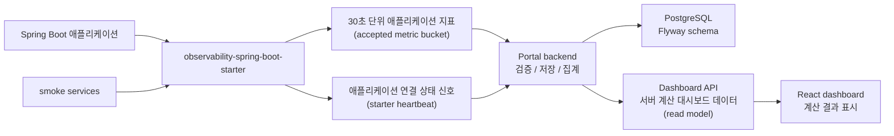

# Observation Portal

Spring Boot 애플리케이션에 관측용 starter를 붙이면, 애플리케이션 지표와 연결 상태를 수집해 운영자가 첫 화면에서 “지금 데이터가 들어오는지, 어떤 API부터 봐야 하는지” 판단할 수 있게 돕는 observability dashboard.

## 문제 정의

작은 서비스나 팀에서는 Prometheus, Grafana, APM 전체 구성을 한 번에 갖추기보다, Spring Boot 애플리케이션에 최소 설정을 붙여 운영 첫 화면을 빠르게 확보하는 일이 먼저 필요할 때가 많습니다.

Observation Portal은 이 문제를 starter-first 방식으로 풀었습니다. 호스트 애플리케이션은 관측용 Spring Boot starter를 통해 30초 단위 애플리케이션 지표와 연결 상태 신호를 포털로 보내고, 포털은 이를 검증, 저장, 집계해 운영자가 바로 판단할 수 있는 대시보드 데이터를 제공합니다.

## 주요 기능

- Spring Boot starter 기반 애플리케이션 지표 수집
- 애플리케이션, 인스턴스, API 엔드포인트 단위 상태 확인
- 지표 수집 상태와 애플리케이션 연결 상태를 분리해서 표시
- p95/p99 latency, error rate, endpoint priority 등 서버 계산 결과 표시
- GitHub OAuth 기반 프로젝트 접근
- starter credential 생성, 회전, 폐기 흐름
- 생성/회전 직후 starter credential 원문 1회 표시
- snapshot/history 기반 최근 상태 변화 확인
- smoke service와 ECC endpoint-shaped traffic을 통한 실제 HTTP route 관측 경로 검증

## 아키텍처



- Spring Boot starter가 Micrometer observation을 기반으로 애플리케이션 지표를 모읍니다.
- Portal backend가 수집 데이터를 검증하고 PostgreSQL에 저장한 뒤, 운영 판단에 필요한 형태로 집계합니다.
- Dashboard API가 상태, 신선도, p95/p99, triage, endpoint priority, snapshot/history 데이터를 계산해서 제공합니다.
- Frontend는 서버가 계산한 결과를 재계산하지 않고 표시합니다.
- Smoke service가 Spring MVC 요청 경로를 실제로 태워 starter의 HTTP route 관측 경로를 검증합니다.

## 기술 스택

| 영역 | 사용 기술 |
|---|---|
| Backend | Java 17, Spring Boot, Spring MVC, JPA, Flyway, PostgreSQL, Micrometer |
| Frontend | React, TypeScript, Vite, Tailwind/shadcn 스타일 UI |
| Test/Verification | JUnit, MockMvc, Testcontainers, Gradle, smoke scripts |

## 실행 방법

프론트엔드는 Vite SPA로 구성되어 있으며, 타입 검사와 빌드로 정적 자산을 확인할 수 있습니다.

```bash
npm --prefix frontend ci
npm --prefix frontend run typecheck
npm --prefix frontend run build
```

포털 백엔드는 PostgreSQL, GitHub OAuth, 토큰 서명 키 등 필요한 환경 변수를 설정한 뒤 Gradle로 실행하거나 bootJar를 만들 수 있습니다.

```bash
./gradlew test
./gradlew :observability-portal:bootJar
./gradlew :observability-portal:bootRun
```

starter가 붙은 smoke service는 starter credential 환경 변수를 설정한 뒤 실행합니다.

```bash
OBSERVATION_SMOKE_PROJECT_KEY='<starter credential>' \
./gradlew :observability-smoke-service:bootRun --args='--spring.profiles.active=local-smoke'
```

ECC endpoint-shaped traffic 검증용 서비스도 별도 프로필로 실행할 수 있습니다.

```bash
ECC_ENDPOINT_SMOKE_PROJECT_KEY='<starter credential>' \
./gradlew :ecc-endpoint-smoke-service:bootRun --args='--spring.profiles.active=local-ecc'
```

서비스가 떠 있으면 polling script로 다양한 HTTP route 호출을 생성합니다.

```bash
scripts/smoke/run-ecc-endpoint-polling.py
```

## 검증 방법

대표 검증 명령은 아래와 같습니다.

```bash
npm --prefix frontend run typecheck
npm --prefix frontend run build
./gradlew test
./gradlew :ecc-endpoint-smoke-service:test
scripts/smoke/run-ecc-endpoint-polling.py
```

검증 범위는 프론트엔드 타입/빌드, Spring MVC controller, service/repository, Flyway 기반 PostgreSQL integration, dashboard read model, starter boundary, smoke traffic까지 이어집니다.

## 포트폴리오 관점의 핵심 구현 포인트

Observation Portal은 단순 CRUD가 아니라 수집, 보안, 집계, 상태 판단, UI 표현까지 연결된 end-to-end 제품입니다.

- 수집 경계: starter가 Spring Boot 애플리케이션의 HTTP observation을 30초 단위 지표로 모으고, 요청 처리 경로와 전송 경로를 분리합니다.
- 보안 경계: project key, token, OAuth payload, credential 원문이 응답, 로그, 저장소에 남지 않도록 다루며, starter credential은 생성/회전 직후 1회 표시로 제한합니다.
- 데이터 경계: 지표 수집 상태와 연결 상태 신호를 섞지 않고, 운영자가 각각의 의미를 따로 판단할 수 있게 보여줍니다.
- 계산 경계: p95/p99, lifecycle state, triage, endpoint priority는 서버가 계산하고 프론트엔드는 서버 응답을 표시합니다.
- 검증 경계: 단위 테스트, MockMvc 기반 controller 테스트, Testcontainers 기반 PostgreSQL 통합 테스트, smoke traffic으로 구현 경로를 확인합니다.

## 다음 확장 계획

1. Discord 알림
   - 중요한 상태 변화나 장애 후보를 Discord로 알림

2. SQS + Lambda 기반 수집 파이프라인
   - 인스턴스별 ingest 요청을 매번 DB에 바로 쓰지 않고 SQS에 적재
   - Lambda가 1분 간격으로 batch insert
   - 늦게 도착하는 ingest를 고려해 snapshot 생성 시점을 약간 늦춰 데이터 누락 위험을 줄이는 방향

3. Cache hit ratio 추가
   - API/서비스 관점에서 cache 효율을 대시보드 지표로 확장
