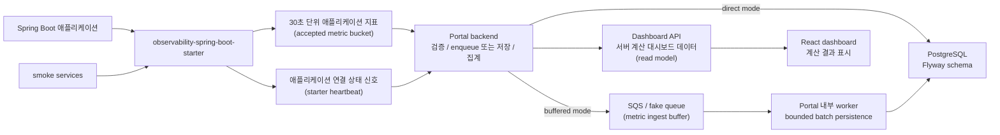

# Observation Portal

Spring Boot 애플리케이션에 관측용 starter를 붙이면, 애플리케이션 지표와 연결 상태를 수집해 운영자가 첫 화면에서 “지금 데이터가 들어오는지, 어떤 API부터 봐야 하는지” 판단할 수 있게 돕는 observability dashboard.

## 문제 정의

작은 서비스나 팀에서는 Prometheus, Grafana, APM 전체 구성을 한 번에 갖추기보다, Spring Boot 애플리케이션에 최소 설정을 붙여 운영 첫 화면을 빠르게 확보하는 일이 먼저 필요할 때가 많습니다.

Observation Portal은 이 문제를 starter-first 방식으로 풀었습니다. 호스트 애플리케이션은 관측용 Spring Boot starter를 통해 30초 단위 애플리케이션 지표와 연결 상태 신호를 포털로 보내고, 포털은 이를 검증, 저장, 집계해 운영자가 바로 판단할 수 있는 대시보드 데이터를 제공합니다.

## 주요 기능

- Spring Boot starter 기반 애플리케이션 지표 수집
- request path와 DB persistence path를 분리한 SQS/fake queue buffered ingest
- 애플리케이션, 인스턴스, API 엔드포인트 단위 상태 확인
- 지표 수집 상태와 애플리케이션 연결 상태를 분리해서 표시
- p95/p99 latency, error rate, endpoint priority 등 서버 계산 결과 표시
- GitHub OAuth 기반 프로젝트 접근
- starter credential 생성, 회전, 폐기 흐름
- 생성/회전 직후 starter credential 원문 1회 표시
- snapshot/history 기반 최근 상태 변화 확인
- smoke service와 ECC endpoint-shaped traffic을 통한 실제 HTTP route 관측 경로 검증

## 아키텍처



- Spring Boot starter가 Micrometer observation을 기반으로 애플리케이션 지표를 모읍니다.
- Portal backend가 수집 데이터를 검증하고 PostgreSQL에 저장한 뒤, 운영 판단에 필요한 형태로 집계합니다.
- SQS buffered ingest mode에서는 request thread가 검증과 enqueue까지만 수행하고 `202 queued`를 반환하며, PostgreSQL 저장은 Spring Boot portal 내부 worker가 처리합니다.
- Dashboard API가 상태, 신선도, p95/p99, triage, endpoint priority, snapshot/history 데이터를 계산해서 제공합니다.
- Snapshot/history는 저장 당시 dashboard read model을 읽습니다. 새 scheduled/fallback snapshot 저장은 accepted bucket 이력과 최근 starter heartbeat가 함께 있을 때만 허용하며, heartbeat가 없거나 오래된 query fallback은 저장만 건너뛰고 current dashboard response는 계속 성공합니다.
- Starter heartbeat는 연결 상태 신호와 snapshot 저장 gate로만 사용하며, metric freshness/state/read model source로 합성하지 않습니다.
- Frontend는 서버가 계산한 결과를 재계산하지 않고 표시합니다.
- Smoke service가 Spring MVC 요청 경로를 실제로 태워 starter의 HTTP route 관측 경로를 검증합니다.

## 기술 스택

| 영역 | 사용 기술 |
|---|---|
| Backend | Java 17, Spring Boot, Spring MVC, JPA, Flyway, PostgreSQL, Micrometer |
| Frontend | React, TypeScript, Vite, Tailwind/shadcn 스타일 UI |
| Test/Verification | JUnit, MockMvc, Testcontainers, Gradle, smoke scripts |

## 실행 방법

프론트엔드는 Vite SPA로 구성되어 있으며, 타입 검사와 빌드로 정적 자산을 확인할 수 있습니다.

```bash
npm --prefix frontend ci
npm --prefix frontend run typecheck
npm --prefix frontend run build
```

포털 백엔드는 PostgreSQL, GitHub OAuth, 토큰 서명 키 등 필요한 local secret을 준비한 뒤 Gradle로 실행하거나 bootJar를 만들 수 있습니다. Local secret은 읽는 주체가 달라서 목적별로 분리합니다.

- `.env`: shell에서 export할 AWS/SQS와 `PORTAL_INGEST_BUFFER_*` 값
- `.private/github-oauth.properties`: Spring Boot가 import하는 GitHub OAuth, service token, OAuth state signing key
- `.private/smoke-seed.properties`: Spring Boot local smoke seed 설정
- `.private/smoke-auth.env`, `.private/smoke-project.env`: smoke script가 단일 key/value로 파싱하는 access token과 starter project key

이 분리는 AWS credential, OAuth secret, smoke token, raw project key가 서로 다른 실행 경로에 섞이지 않게 하기 위한 local-only guard입니다.

`.env`를 사용하는 SQS buffered ingest 실행은 shell에서 값을 export한 뒤 실행합니다.

```bash
set -a
source .env
set +a
```

```bash
./gradlew test
./gradlew :observability-portal:bootJar
./gradlew :observability-portal:bootRun
```

starter가 붙은 smoke service는 starter credential 환경 변수를 설정한 뒤 실행합니다.

```bash
OBSERVATION_SMOKE_PROJECT_KEY='<starter credential>' \
./gradlew :observability-smoke-service:bootRun --args='--spring.profiles.active=local-smoke'
```

ECC endpoint-shaped traffic 검증용 서비스도 별도 프로필로 실행할 수 있습니다.

```bash
ECC_ENDPOINT_SMOKE_PROJECT_KEY='<starter credential>' \
./gradlew :ecc-endpoint-smoke-service:bootRun --args='--spring.profiles.active=local-ecc'
```

서비스가 떠 있으면 polling script로 다양한 HTTP route 호출을 생성합니다.

```bash
scripts/smoke/run-ecc-endpoint-polling.py
```

snapshot QA처럼 30분마다 다른 상태 신호를 만들고 싶을 때는 2시간 시나리오 모드를 사용합니다.
이 모드는 healthy, error spike, latency spike, error+latency slot을 순서대로 만들며, 지연 응답은
ECC smoke 서버가 의도적으로 늦게 응답해 starter duration bucket과 local p95/p99에 반영되게 합니다.

```bash
scripts/smoke/run-ecc-endpoint-polling.py \
  --scenario-plan snapshot-2h \
  --align-to-half-hour \
  --duration-seconds 7200 \
  --slot-seconds 1800 \
  --interval-seconds 5
```

## 검증 방법

대표 검증 명령은 아래와 같습니다.

```bash
npm --prefix frontend run typecheck
npm --prefix frontend run build
./gradlew test
./gradlew :ecc-endpoint-smoke-service:test
scripts/smoke/run-ecc-endpoint-polling.py
```

검증 범위는 프론트엔드 타입/빌드, Spring MVC controller, service/repository, Flyway 기반 PostgreSQL integration, dashboard read model, starter boundary, smoke traffic까지 이어집니다.

## SQS Buffered Ingest 전환과 benchmark evidence

기존 ingest는 HTTP request thread가 metric bucket 검증뿐 아니라 `accepted_metric_buckets` DB insert까지 수행했습니다. Epic 12에서는 이 경로를 request path와 persistence path로 나누어, request thread가 DB write round trip에 묶이는 병목을 분리했습니다.

SQS/fake queue mode에서 request thread는 project key와 payload를 검증하고 queue message를 만든 뒤 enqueue 성공 시에만 `202 queued`를 반환합니다. 이 응답은 DB 저장 완료, dashboard freshness current, snapshot 반영 완료를 뜻하지 않습니다. 실제 consumer는 Lambda가 아니라 Spring Boot portal 내부 worker이며, Lambda consumer, event source mapping, separate worker service는 구현하지 않았습니다.

Local/test 기본 queue는 fake queue입니다. 따라서 아래 Phase 1 수치는 real SQS network latency evidence가 아니라, 같은 fixture에서 request boundary가 DB insert에서 enqueue로 이동했을 때의 local/isolated benchmark evidence입니다. Benchmark는 Testcontainers PostgreSQL과 fake queue 기준이며, primary fixture는 `applicationCount=1`, `instanceCount=30`, `measurementCount=90`, `batchSize=30`입니다. 이 결과는 production load test, autoscaling proof, cost claim, dashboard UI performance claim으로 해석하지 않습니다.

| Phase 1 request boundary | p50 ms | p95 ms | p99 ms | request-thread accepted bucket rows |
| --- | ---: | ---: | ---: | ---: |
| Direct insert | 3.329 | 4.933 | 6.994 | 90 |
| Fake queue enqueue | 0.114 | 0.212 | 0.495 | 0 |

Fake enqueue 자체의 duration은 p50/p95/p99 `0.001 / 0.002 / 0.010 ms`로 측정됐습니다. 이 표는 request latency만 보여주며, DB persistence throughput claim과 섞지 않습니다.

Worker는 SQS Standard queue의 at-least-once/out-of-order 가능성을 전제로 idempotency를 처리합니다. Same key/same hash duplicate는 `DUPLICATE_NOOP` 성공으로 처리하고, same key/different hash 및 same instance bucket/different key는 application DLQ 대상으로 분리합니다. Snapshot에는 capture delay와 `accepted_at` cutoff를 적용해 queue lag가 stale/down 또는 host application down 의미를 오염시키지 않게 했습니다.

| Phase 2 DB persistence | Inserted | Batch size | Bucket statement count | Batch chunks | Persist duration ms | Throughput |
| --- | ---: | ---: | ---: | ---: | ---: | ---: |
| Worker MVP message-by-message | 90 | - | 90 | - | 175.262 | 513.517 buckets/sec |
| Batch writer | 90 | 30 | 9 | 3 | 49.873 | 1804.581 buckets/sec |

Batch writer는 message-by-message DB insert를 bounded batch persistence로 바꾸어 statement count를 `90 -> 9`로 줄였고, local/isolated benchmark 기준 DB persistence throughput이 `513.5 -> 1804.6 buckets/sec`로 측정됐습니다. 이는 write-side pressure를 낮춘 근거이지, 서비스 전체가 같은 비율로 빨라졌다는 주장은 아닙니다. Same key/same hash duplicate smoke도 first `INSERTED`, duplicate `DUPLICATE_NOOP`로 확인했습니다.

Benchmark artifact:

- [manifest.json](implementation-artifacts/benchmark-evidence/story-12-6/manifest.json)
- [phase-1-request-latency.json](implementation-artifacts/benchmark-evidence/story-12-6/phase-1-request-latency.json)
- [phase-2-db-throughput.json](implementation-artifacts/benchmark-evidence/story-12-6/phase-2-db-throughput.json)
- [report.md](implementation-artifacts/benchmark-evidence/story-12-6/report.md)

## 핵심 구현 포인트

Observation Portal은 단순 CRUD가 아니라 수집, 보안, 집계, 상태 판단, UI 표현까지 연결된 end-to-end 제품입니다.

- 수집 경계: starter가 Spring Boot 애플리케이션의 HTTP observation을 30초 단위 지표로 모으고, 요청 처리 경로와 전송 경로를 분리합니다.
- 보안 경계: project key, token, OAuth payload, credential 원문이 응답, 로그, 저장소에 남지 않도록 다루며, starter credential은 생성/회전 직후 1회 표시로 제한합니다.
- 데이터 경계: 지표 수집 상태와 연결 상태 신호를 섞지 않고, 운영자가 각각의 의미를 따로 판단할 수 있게 보여줍니다.
- 계산 경계: p95/p99, lifecycle state, triage, endpoint priority는 서버가 계산하고 프론트엔드는 서버 응답을 표시합니다.
- 검증 경계: 단위 테스트, MockMvc 기반 controller 테스트, Testcontainers 기반 PostgreSQL 통합 테스트, smoke traffic으로 구현 경로를 확인합니다.

## 다음 확장 계획

1. Discord 알림
   - 중요한 상태 변화나 장애 후보를 Discord로 알림

2. 운영 smoke와 전환 runbook 고도화
   - 실제 SQS queue, worker receive/delete, malformed/conflict DLQ, direct rollback config를 배포 환경 smoke로 분리 검증
   - local/isolated benchmark evidence를 운영 성능 보증으로 확장하지 않도록 전환 기준과 runbook을 정리

3. Cache hit ratio 추가
   - API/서비스 관점에서 cache 효율을 대시보드 지표로 확장
