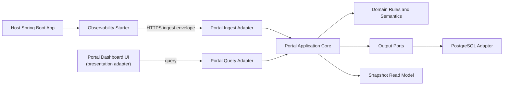

# Architecture - Spring Boot 운영 첫 화면 포털

## 1. 결정 요약

이 프로젝트의 새 아키텍처는 **Lightweight Hexagonal** 하나로 고정한다.

Simple MVC, layered service/repository 구조, pull-based metric query 중심 구조, 또는 여러 스타일을 섞은 hybrid 구조는 이번 산출물의 기준이 아니다. 기존 산출물에서 유지하는 것은 제품 문제와 UX 의도뿐이다.

### 선택한 이유

- 제품 약속은 `starter를 붙이면 30~60초 안에 운영 첫 화면이 보인다`이다.
- 핵심 복잡도는 UI 라우팅이 아니라 ingest 계약, histogram merge, freshness/state semantics, triage rule, snapshot read model에 있다.
- Lightweight Hexagonal은 이 복잡도를 domain/application 안에 고정하고, Spring web, PostgreSQL, HTTP client, scheduler를 adapter로 밀어낸다.
- 2인 1개월 MVP이므로 과한 포트 남발은 금지하고, 외부 경계와 테스트 가치가 큰 지점에만 port를 둔다.

## 2. 아키텍처 원칙

1. Domain과 application use case가 제품 언어의 단일 원천이다.
2. Web controller, persistence repository, HTTP client, scheduler, Spring auto-configuration은 adapter다.
3. Controller는 요청 변환과 응답 변환만 맡는다.
4. Persistence adapter는 저장과 조회 최적화만 맡고, state/rule 판단을 새로 하지 않는다.
5. UI는 read model을 표시한다. endpoint ranking이나 app state를 화면에서 재계산하지 않는다.
6. Port는 외부 경계에만 둔다. 내부 class마다 interface를 만들지 않는다.
7. Domain과 application core는 Spring framework 의존을 갖지 않는다.
8. MVP 필수 경로에 pull-based metric collection, scrape configuration, query UI는 포함하지 않는다.
9. 첫 화면은 `alive / slow / error / where to look first`를 30~60초 안에 답해야 한다. 이 기준을 만족하지 못하면 아키텍처는 실패다.

## 3. 시스템 경계



### Deployable

MVP runtime deployable은 두 개다.

- `observability-spring-boot-starter`
  - host app 안에서 동작하는 library/starter다.
  - Micrometer metric을 low-cardinality bucket으로 모으고 portal ingest API로 비동기 전송한다.
- `observability-portal`
  - ingest API, persistence, histogram merge, state semantics, triage read model, dashboard API를 제공한다.
  - dashboard UI는 MVP에서 별도 backend deployable이 아니라 portal의 presentation adapter로 포함한다.
  - UI는 portal application이 만든 read model만 표시하고 별도 판단 engine을 갖지 않는다.

## 4. Starter Hexagon

### Starter Domain

- `ApplicationIdentity`
- `InstanceIdentity`
- `NormalizedRoute`
- `MetricBucket`
- `EndpointHistogramBucket`
- `FlushCadence`
- `DropPolicy`

Starter domain은 bucket shape와 low-cardinality guard를 책임진다. Spring request 객체나 Micrometer registry 객체를 직접 들고 다니지 않는다.

### Starter Application Use Cases

- `CollectHttpObservationUseCase`
- `RollupMetricBucketUseCase`
- `FlushMetricBucketUseCase`
- `BuildIngestEnvelopeUseCase`

### Starter Inbound Adapters

- Spring Boot auto-configuration
- Micrometer observation/timer binding
- HTTP route normalization hook
- scheduled/background flush trigger

### Starter Inbound Ports

| Port | Adapter | 목적 |
|---|---|---|
| `RecordHttpObservationPort` | Micrometer observation/timer binding | Spring/Micrometer signal을 순수 observation input으로 변환해 기록 |
| `FlushDueMetricBucketsPort` | scheduled/background flush trigger | due bucket을 찾아 envelope 생성과 전송을 시작 |

Inbound port input은 `ApplicationIdentity`, `NormalizedRoute`, `ObservedHttpExchange`, `ObservedRuntimeSample` 같은 starter domain/application DTO만 사용한다. Spring request, Micrometer registry, timer 객체는 adapter 밖으로 새지 않는다.

### Starter Outbound Ports

| Port | 목적 |
|---|---|
| `IngestClientPort` | portal ingest API로 envelope 전송 |
| `ClockPort` | UTC bucket boundary 계산 |
| `InstanceIdentityPort` | hostname, pod name, generated id 확보 |
| `BoundedQueuePort` | request thread와 flush worker 분리 |

### Starter Outbound Adapters

- HTTPS ingest client
- in-memory bounded queue
- system clock
- host/pod identity resolver

### Starter Boundary Rules

- request thread에서는 network call을 하지 않는다.
- request thread는 bounded queue enqueue만 시도한다.
- queue가 가득 차면 configured drop policy를 적용하고 host app business flow를 계속 진행한다.
- flush worker의 HTTP timeout, retry, backoff는 request path와 분리한다.
- MVP에서는 durable outbox를 두지 않는다. 장애 허용 정책은 bounded queue + retry/backoff + drop이다.

## 5. Portal Hexagon

### Portal Domain

- `Project`
- `Application`
- `Instance`
- `AcceptedMetricBucket`
- `HistogramSeries`
- `LifecycleState`
- `FreshnessStatus`
- `RuleCandidate`
- `AppTriageSummary`
- `EndpointPriority`

Portal domain은 accepted ingest bucket에서 app state, p95, triage candidate, endpoint priority를 계산하는 의미 규칙을 가진다.

### Portal Application Use Cases

| Use Case | 책임 |
|---|---|
| `AcceptIngestEnvelopeUseCase` | 인증된 ingest payload 검증, idempotency 판단, bucket 저장 |
| `MergeHistogramBucketsUseCase` | instance bucket을 app/endpoint 기준으로 병합 |
| `EvaluateLifecycleStateUseCase` | waiting first data, unknown, idle, stale, down 판정 |
| `BuildAppTriageSummaryUseCase` | app-level summary와 rationale 생성 |
| `ListEndpointPriorityUseCase` | slow/error/comparative evidence 기반 endpoint 목록 생성 |
| `QueryDashboardSnapshotUseCase` | UI가 그대로 표시할 read model 반환 |

### Portal Inbound Ports

| Port | Adapter |
|---|---|
| `AcceptIngestEnvelopeCommand` | ingest REST controller |
| `QueryDashboardSnapshotQuery` | dashboard REST controller |
| `ListEndpointPriorityQuery` | dashboard REST controller |

### Portal Outbound Ports

| Port | 목적 |
|---|---|
| `ProjectKeyVerifierPort` | project key 검증 |
| `MetricBucketStorePort` | accepted bucket 저장과 idempotency 확인 |
| `SnapshotStorePort` | dashboard snapshot 저장/조회 |
| `ApplicationCatalogPort` | project/application/environment 식별 |
| `ClockPort` | freshness와 window 계산 |

### Portal Adapters

- `adapter.in.web`
  - `IngestController`
  - `DashboardQueryController`
- `adapter.out.persistence`
  - PostgreSQL 기반 bucket/snapshot adapter
- `adapter.out.security`
  - project key verifier
- `adapter.out.time`
  - UTC clock adapter
- `bootstrap`
  - Spring configuration, transaction boundary, dependency wiring

### Portal Boundary Rules

- read model 생성 책임은 portal application service에만 있다.
- PostgreSQL view, dashboard REST controller, frontend는 lifecycle state, insight rule, endpoint priority를 계산하지 않는다.
- persistence adapter는 accepted bucket과 derived snapshot을 저장/조회할 수 있지만 의미 판단을 만들지 않는다.

## 6. 데이터 흐름

### 6.1 Ingest Flow

1. host app request와 runtime signal이 Micrometer로 관측된다.
2. starter adapter가 observation을 starter application use case로 전달한다.
3. starter domain은 route normalization과 low-cardinality guard를 적용한다.
4. starter는 30초 UTC bucket으로 app summary와 endpoint histogram bucket을 만든다.
5. background worker가 ingest envelope를 만들고 HTTPS POST를 수행한다.
6. portal ingest adapter는 payload를 command로 변환한다.
7. portal application은 project key, schema version, idempotency key, bucket boundary를 검증한다.
8. portal persistence adapter가 accepted bucket을 저장한다.
9. portal application은 histogram merge와 read model refresh를 수행한다.
10. dashboard query adapter는 snapshot read model을 UI에 반환한다.

### 6.2 Read Flow

1. UI가 dashboard snapshot을 요청한다.
2. query adapter는 application query object로 변환한다.
3. application use case는 current 15분 window와 baseline 15분 window 기준 snapshot을 조회한다.
4. state semantics와 insight rules는 application/domain에서만 평가된다.
5. UI는 반환된 state, metrics, zero-insight reason, recovery guidance, triage cards, endpoint priority를 표시한다.

## 7. 저장소 결정

Portal DB는 PostgreSQL을 기본 선택으로 둔다.

저장 목적은 아래 세 가지다.

- project/application metadata
- bounded accepted bucket data
- derived dashboard snapshot/read model

PostgreSQL을 범용 TSDB처럼 쓰지 않는다. raw unrestricted timeseries query, arbitrary tag search, high-cardinality custom metric 저장은 MVP 범위 밖이다.

### Persistence Boundary

Persistence adapter는 다음을 보장한다.

- idempotency key unique constraint
- bucket start/end UTC 저장
- project/application/environment/instance 식별자 정규화
- accepted bucket과 derived snapshot의 transactional consistency

Persistence adapter는 다음을 하지 않는다.

- lifecycle state 판단
- insight rule ranking
- endpoint priority 재계산
- UI 문구 생성

## 8. API Boundary

### Ingest API

- `POST /api/ingest/v1/buckets`
- 인증: `X-OBS-Project-Key`
- 멱등성: `Idempotency-Key`
- payload: `ingest-envelope` contract를 따른다.

### Dashboard API

- `GET /api/projects/{projectId}/applications/{applicationId}/dashboard`
- 반환값은 `read-model-contract` contract를 따른다.
- UI는 이 응답을 source of truth로 사용한다.

## 9. Failure Policy

### Starter Failure

- host app request thread는 portal 응답을 기다리지 않는다.
- bounded queue가 가득 차면 정책에 따라 drop할 수 있다.
- retry/backoff는 background worker 안에서만 수행한다.
- ingest 실패는 host app business flow에 영향을 주지 않는다.
- outbound HTTP timeout은 flush worker 안에서만 적용한다.
- request thread에서 portal 장애를 관측 가능한 latency로 전파하지 않는다.

### Portal Failure

- ingest payload 검증 실패는 4xx로 반환한다.
- 중복 payload는 idempotent success로 처리한다.
- persistence 장애는 5xx로 반환하되 starter가 비동기로 재시도하거나 drop한다.
- portal 장애는 host app request path를 막지 않는다.

## 10. Package Map

### Starter

```text
starter
  domain
  application
    port.in
    port.out
  adapter.in.spring
  adapter.out.http
  adapter.out.queue
  bootstrap
```

### Portal

```text
portal
  domain
  application
    port.in
    port.out
  adapter.in.web
  adapter.out.persistence
  adapter.out.security
  adapter.out.time
  bootstrap
```

## 11. 테스트 전략

- Domain test: state semantics, histogram merge, rule ranking, endpoint priority.
- Application use case test: ingest acceptance, idempotency, read model build.
- Adapter test: REST contract, PostgreSQL repository, project key verification.
- Starter test: route normalization, bucket rollup, queue overflow, HTTP client failure.
- Architecture boundary test: domain/application이 adapter와 Spring web/persistence 타입을 참조하지 않는지 검사.
- Negative MVP path test: scrape config, pull metric query, arbitrary query UI, high-cardinality tag path가 없음을 검사.
- Read model snapshot test: `triageCards=[]`일 때 zero-insight reason과 recommended action이 항상 내려오는지 검사.
- Histogram golden fixture test: 동일 bucket set에서 server-side merge p95가 fixture 기대값과 일치하는지 검사.
- Non-blocking ingest test: portal timeout/down 상황에서도 host request latency가 network timeout을 기다리지 않는지 검사.
- End-to-end slice: starter emits first bucket -> portal accepts -> dashboard shows app alive.

## 12. 명시적으로 계승하지 않는 결정

- pull-based metric backend를 MVP source of truth로 두는 결정
- scrape target, selector bootstrap, query profile 중심 구조
- controller-service-repository layered MVC를 아키텍처 스타일로 삼는 결정
- UI에서 endpoint ranking 또는 state semantics를 재계산하는 결정
- 범용 metric platform이나 arbitrary query UI로 확장하는 결정

이번 아키텍처의 단일 선택은 **Lightweight Hexagonal**이다.
