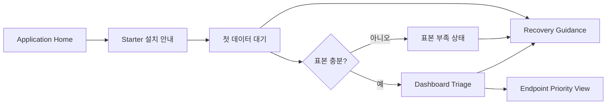

---
stepsCompleted:
  - step-01-init
  - step-02-discovery
  - step-03-core-experience
  - step-04-emotional-response
  - step-05-inspiration
  - step-06-design-system
  - step-07-defining-experience
  - step-08-visual-foundation
  - step-09-design-directions
  - step-10-user-journeys
  - step-11-component-strategy
  - step-12-ux-patterns
  - step-13-responsive-accessibility
  - step-14-complete
inputDocuments:
  - /Users/tlsdla1235/Desktop/study/관프/{output_folder}/planning-artifacts/prd.md
  - /Users/tlsdla1235/Desktop/study/관프/observability_toy_spec_v0.8.md
  - /Users/tlsdla1235/Desktop/study/관프/{output_folder}/planning-artifacts/micrometer-direct-ingest-pivot-prep.md
  - /Users/tlsdla1235/Desktop/study/관프/{output_folder}/planning-artifacts/legacy-archive/2026-05-06-prometheus-pivot/planning-artifacts/ux-design-directions.html
  - /Users/tlsdla1235/Desktop/study/관프/{output_folder}/planning-artifacts/legacy-archive/2026-05-06-prometheus-pivot/planning-artifacts/ux-color-themes.html
projectName: Spring Boot 운영 첫 화면 포털
workflowStatus: complete
workflowType: create
lastStep: 14
date: 2026-05-06
generatedArtifacts:
  - /Users/tlsdla1235/Desktop/study/관프/{output_folder}/planning-artifacts/ux-first-screen-scenarios.html
---

# UX Design Specification - Spring Boot 운영 첫 화면 포털

**Author:** tlsdla1235  
**Date:** 2026-05-06

## Executive Summary

### Project Vision

이 제품의 UX 목표는 `starter를 붙이면 된다`는 약속을 화면 경험으로 증명하는 것이다. 사용자는 복잡한 관측성 스택을 배우기 전에, 첫 화면만으로 아래 질문에 답을 얻어야 한다.

- 지금 살아 있나
- 느려졌나
- 에러가 늘었나
- 어디부터 볼까

이 UX는 범용 대시보드가 아니라 `state-first triage desk`다. 차트는 증거이고, 첫 화면의 주인공은 상태 의미, 상위 `0~3개` insight, 다음 확인 행동이다.

### Target Users

#### 1. 초보 운영자

- Spring Boot 앱은 운영하지만 Prometheus, Grafana, scrape config를 잘 모른다.
- 이상이 생기면 로그부터 뒤지기 쉽다.
- "무엇을 먼저 봐야 하는지"를 제품이 먼저 말해주길 원한다.

#### 2. 작은 팀의 서비스 소유자

- 운영 전담 인력이 없는 팀에서 설치 마찰이 낮은 도구를 원한다.
- 팀원끼리 같은 상태 언어와 같은 첫 판단 화면을 공유하고 싶다.

#### 3. 협업 조사자

- 앱 상태를 본 뒤 slow/error endpoint 후보를 고르고, 그 흐름을 바로 이어서 확인하고 싶다.
- 깊은 원인 진단보다, 첫 확인 순서가 잡히는 것이 더 중요하다.

### Key Design Challenges

- `waiting first data`, `insufficient sample`, `no triage worth surfacing`, `stale`, `down`을 서로 다르게 느껴지게 해야 한다.
- 상태 semantics를 먼저 읽게 하면서도 화면이 무겁거나 위협적으로 보이지 않아야 한다.
- insight가 없을 때도 빈 화면처럼 보이지 않고, 왜 아무것도 띄우지 않았는지 제품이 설명해야 한다.
- `Split Desk`가 generic data panel이 아니라 `next check surface`로 읽히게 해야 한다.

### Design Opportunities

- direct ingest 피벗 덕분에 설치 성공 경험과 첫 화면 경험을 더 짧고 일관되게 묶을 수 있다.
- `0-insight` 상태를 정직하게 다루면 제품 신뢰를 빠르게 얻을 수 있다.
- triage output을 UX 표면에서 먼저 정의하면, 이후 scoring/gating spec과 architecture가 같은 표현 계약을 공유하기 쉬워진다.
- app-level error spike를 Discord push로 재사용하면, 사용자가 화면을 열기 전에도 같은 triage 문장을 받을 수 있다.

## Core User Experience

### Defining Experience

이 제품의 defining experience는 `한 화면에서 빠르게 안심하거나, 한 화면에서 바로 다음 확인 행동을 정하는 경험`이다.

핵심 인터랙션은 아래 순서로 고정한다.

1. 상태와 freshness를 읽는다.
2. 현재 insight가 있는지, 없는지, 왜 없는지 읽는다.
3. 지금 가장 먼저 볼 endpoint 또는 recovery next step을 고른다.
4. 필요하면 endpoint priority 또는 recovery panel로 내려간다.

### First-Screen Contract

첫 화면은 아래 문장을 시각적으로 증명해야 한다.

> 이 화면은 데이터를 많이 보여주기 위한 곳이 아니라, 지금 무엇을 믿을 수 있고 다음에 무엇을 보면 되는지 먼저 말해주는 곳이다.

첫 화면 above the fold 계약은 아래와 같다.

1. 상태 strip이 가장 먼저 보인다.
2. insight zone은 최대 `0~3개`만 노출한다.
3. insight가 `0개`여도 제품은 이유를 말한다.
4. split desk는 `slow/error endpoint` 또는 `recovery next step`을 이어서 보여준다.
5. 차트와 세부 evidence는 below the fold로 밀린다.

### Information Priority on the First Screen

#### Zone 1. Application Context Rail

- application name
- environment
- last accepted bucket time
- starter heartbeat / connection status, 표시 시 별도 축으로 분리
- current window / baseline window
- project key / connection context

#### Zone 2. State Semantic Strip

- primary state
- freshness badge
- one-line explanation
- next action line

상태는 반드시 `색상 + 아이콘 + 텍스트`를 함께 사용한다.

#### Zone 3. Insight Stack

- 상위 `0~3개`만 허용
- triage card는 `무슨 일이 보였는가 / 어디부터 볼까 / 왜 그렇게 말하는가` 순서로 짧게 말한다
- 증거 부족이면 카드를 만들지 않고 설명 상태를 노출한다

#### Zone 4. Summary Metrics Row

- request count
- error rate
- p95 latency
- datasource / CPU / heap hint

수치는 해석을 보조해야 하며, 첫 해석을 대신하면 안 된다.

#### Zone 5. Split Desk

- left: slow endpoints
- right: error endpoints
- 또는 상태가 recovery 우선일 때는 recovery desk

이 영역은 generic exploration이 아니라 `next check surface`다. 사용자가 바로 무엇을 눌러야 할지 보여줘야 한다.

#### Zone 6. Evidence Below the Fold

- detailed charts
- more endpoints
- bounded endpoint evidence
- instance-local 30초 bucket p95/p99 summary 후보

#### Zone 7. Alert Surface

- 현재 application의 Discord webhook 연결 상태
- 최근 발송 알림 1~3건
- 마지막 발송 concern과 deep link

알림 surface는 첫 화면의 주인공이 아니지만, `화면에서 보던 concern이 Discord에도 같은 말로 갔는지`를 확인하게 해줘야 한다.

### 0-Insight State Model

`0-insight`는 하나의 상태가 아니다. 아래 세 상태를 분리해서 다룬다.

| State | 의미 | Primary Copy | Recommended Next Action | UX Tone |
| --- | --- | --- | --- | --- |
| `waiting first data` | 아직 accepted bucket이 없어 application state를 판단할 수 없음. starter heartbeat가 있어도 이 상태가 유지될 수 있음 | `첫 데이터를 기다리는 중입니다.` | `앱을 30초 정도 더 실행하거나 몇 개의 요청을 발생시켜 보세요.` | 기대감, 진행 중 |
| `insufficient sample` | 신호는 들어오지만 비교형 판단을 내릴 표본이 부족함 | `아직 판단 표본이 부족합니다.` | `조금 더 트래픽을 모으거나 짧은 시나리오 요청을 재생해 보세요.` | 정직함, 미완료 |
| `no triage worth surfacing` | 충분히 봤지만 지금 우선 띄울 이슈가 없음 | `지금 우선 띄울 triage는 없습니다.` | `slow/error endpoint를 훑어보거나 이 상태를 기준선으로 삼으세요.` | 안정감, 차분함 |

세 상태는 아래 요소가 서로 달라야 한다.

- 아이콘
- 제목 문구
- 보조 설명 톤
- 추천 next action
- split desk의 우선 콘텐츠

### Triage-Present State

insight가 있을 때는 아래 규칙을 따른다.

- 카드 수는 최대 `3`
- 첫 카드는 가장 행동 가능성이 높은 concern
- 중복 원인의 카드 분리 금지
- split desk는 카드의 판단 흐름을 뒷받침해야 한다
- recovery state와 triage state가 동시에 경쟁하면 recovery가 먼저 온다
- `global error spike`가 고신뢰 concern이면 Discord push 알림으로 재사용할 수 있다

### Recovery-First States

`stale`, `down`, `unknown`에 가까운 상태는 첫 화면의 관심을 insight보다 recovery로 옮긴다.

- hero 영역은 상태 설명을 크게 보여준다
- insight stack은 있더라도 보조 위치로 내려간다
- split desk는 endpoint list보다 recovery checklist를 우선한다
- copy는 원인 단정이 아니라 확인 제안이어야 한다

### Alerting UX Principle

Discord 알림은 별도 제품이 아니라 대시보드 triage의 바깥 전달 수단이다.

- 알림이 대시보드보다 더 강한 단정 문구를 쓰면 안 된다.
- 알림은 `무슨 일이 보였는가 / 어디부터 볼까 / 링크` 정도만 짧게 전달한다.
- 알림 설정은 `한 채널, 한 webhook, 최소 on/off` 수준으로 단순해야 한다.
- alert fatigue를 피하기 위해 MVP에서는 `app-level error spike` 같은 고신뢰 concern에 집중한다.

## Desired Emotional Response

### Primary Emotional Goals

- 혼란보다 정렬
- 공포보다 차분한 긴급감
- 침묵보다 정직한 안내
- 혼자 추측하는 감각보다 팀이 같은 화면을 본다는 안정감

### Emotional Journey Mapping

#### 설치 직후

`이건 복잡한 운영 툴이 아니라 바로 써볼 수 있는 화면이구나`

#### 첫 데이터 대기 중

`아직 안 보이는 이유를 제품이 알고 있구나`

#### 표본 부족 상태

`문제가 없다는 말이 아니라 아직 판단 중이라는 걸 솔직하게 말하네`

#### 이상 감지 상태

`원인은 모르지만 어디부터 봐야 하는지는 알겠다`

#### triage 없음 상태

`지금은 급한 이슈가 없고, 이 화면을 기준선으로 볼 수 있겠다`

## UX Pattern Analysis & Inspiration

### Active Visual References

- `Signal Strip + Split Desk + Guided Recovery` 하이브리드를 첫 화면의 구조 기준으로 유지한다.
- `Calm Ops Desk`를 기본 톤으로 유지한다.

### Patterns to Keep

- status-first header
- limited-card prioritization
- split evidence surface
- recovery guidance above dense analytics
- calm light-base visual tone

### Anti-Patterns to Avoid

- 큰 차트가 화면의 주인공이 되는 구성
- `0-insight`를 빈 공간으로 처리하는 구성
- 상태를 색상에만 의존하는 구성
- low-cardinality guard를 깨는 raw path 중심 목록
- "원인을 찾았다"처럼 과장하는 copy

## Design System Foundation

### Visual Direction

기본 시각 방향은 `Calm Ops Desk`다.

- warm neutral canvas
- white surface cards
- teal primary action
- amber stale warning
- deep red down state
- gray-blue unknown / sample-insufficient tone

### Color Tokens

| Token | Value | Usage |
| --- | --- | --- |
| `bg.canvas` | `#F4F1EA` | 전체 캔버스 |
| `bg.surface` | `#FFFFFF` | 카드 배경 |
| `bg.panel` | `#EEE7DA` | 보조 패널 |
| `fg.default` | `#1F2937` | 기본 텍스트 |
| `fg.muted` | `#5B6472` | 보조 설명 |
| `accent.primary` | `#0F766E` | 주요 행동 |
| `state.waiting` | `#2563EB` | 첫 데이터 대기 |
| `state.sample` | `#64748B` | 표본 부족 |
| `state.calm` | `#157347` | surfacing 없음 |
| `state.stale` | `#C05621` | 수신 지연 |
| `state.down` | `#B91C1C` | 데이터 중단 / 장애 후보 |

### Typography

- Heading: `Noto Serif KR`
- Body: `IBM Plex Sans KR`
- Technical / code-like values: `JetBrains Mono`

원칙은 `해석 문장은 또렷하게, 수치는 크게, 상태는 짧게`다.

### Motion

- 상태 전환은 짧고 안정적으로
- recovery panel 진입은 slide/fade 조합
- shimmer나 과한 pulse는 피한다

제품은 흥분시키는 도구가 아니라 정렬시키는 도구처럼 보여야 한다.

## Screen Map & Navigation Model

### Screen Inventory

#### 1. Application Home

- application list
- last seen
- state badge
- starter install progress hint

#### 2. Starter Setup / First Data Prep

- dependency + minimal config 안내
- project key 확인
- outbound HTTPS 확인
- starter heartbeat 수신 여부
- 마지막 accepted bucket 수신 여부
- 첫 데이터 대기 진입 CTA

#### 3. First Data Waiting

- waiting state hero
- ingest freshness explanation
- short checklist
- `몇 개의 요청을 발생시켜 보세요` CTA

#### 4. Insufficient Sample

- sample-insufficient hero
- `신호는 도착했지만 비교형 판단은 아직 이름을 붙일 수 없음` 설명
- 트래픽 유도 CTA
- muted split desk

#### 5. No Triage Worth Surfacing

- calm summary hero
- 기준선 삼기 제안
- slow/error endpoint 미리보기
- no-alert tone 유지

#### 6. Dashboard Triage

- state strip
- insight `0~3`
- split desk
- resource hints

#### 7. Alert Settings

- Discord webhook URL 등록
- alert on/off toggle
- 마지막 테스트 또는 마지막 발송 상태
- 발송 문구 미리보기

#### 8. Alert Delivery Context

- 최근 발송 알림 리스트
- 어떤 concern 때문에 발송됐는지
- dashboard deep link
- 발송 실패 시 짧은 재시도 안내

#### 9. Endpoint Priority View

- route summary
- why this endpoint matters
- slow/error evidence snapshot
- related next checks

#### 10. Instance Detail Evidence 후보

- accepted bucket freshness와 starter heartbeat/connection status를 분리 표시
- instance-local 30초 bucket p95/p99 요약을 headline evidence로 표시 가능
- `bucket p99 평균`, `bucket p99 중앙값`, `bucket p99 최댓값`처럼 non-mergeable evidence임을 라벨에 드러냄
- app/project p95/p99, state, rule, endpoint priority를 화면에서 재계산하지 않음

## User Journey Flows

### Journey 1. Starter를 붙이고 첫 화면을 기다린다

1. 사용자가 dependency와 최소 설정을 넣는다.
2. 앱을 실행한다.
3. 화면은 starter heartbeat/connection status와 `waiting first data`를 별도 축으로 보여준다.
4. 첫 accepted bucket이 들어오면 application state와 freshness를 accepted bucket 기준으로 보여준다.
5. 표본이 충분하지 않으면 `insufficient sample`로 정직하게 전환한다.

### Journey 2. low traffic 앱에서 triage 없음 상태를 만난다

1. 사용자가 화면을 연다.
2. 상태는 정상이고 신호는 들어오지만 급한 issue는 없다.
3. 화면은 `지금 우선 노출할 triage는 없습니다`를 보여준다.
4. 사용자는 next action으로 endpoint split을 훑거나 기준선으로 받아들인다.

### Journey 3. 실제 anomaly를 본다

1. 상태 strip이 이상을 먼저 말한다.
2. 상위 1~2개의 triage card가 어디부터 볼지 제안한다.
3. split desk가 같은 판단 흐름을 지지한다.
4. 사용자는 endpoint view로 내려간다.

### Journey 4. error spike 알림을 Discord에서 받고 대시보드로 돌아온다

1. app-level error spike가 고신뢰 concern으로 승격된다.
2. Discord에는 대시보드와 같은 concern 문구와 짧은 next action이 발송된다.
3. 사용자는 deep link로 같은 application 화면에 들어온다.
4. landing 상태는 alert message와 모순되지 않는 triage hero를 보여줘야 한다.

## Component Strategy

### Core Components

- State Semantic Strip
- Insight Stack
- Summary Metric Cards
- Split Desk
- Recovery Guidance Panel
- Sample Sufficiency Banner
- Zero-Insight Explanation Panel
- Discord Alert Settings Card
- Alert Delivery Log Row

### Custom Component Contracts

#### State Semantic Strip

- input: accepted bucket 기반 current state, freshness, one-line explanation, next action
- output: 상단 hero 상태 모듈

#### Insight Stack

- input: ranked concerns `0~3`
- output: triage cards
- rule: no filler cards

#### Zero-Insight Explanation Panel

- input: waiting / sample insufficient / nothing worth surfacing
- output: 서로 다른 title, copy, icon, next action

#### Split Desk

- input: slow list, error list, or recovery checklist
- output: next-check surface

#### Starter Connection Strip 후보

- input: starter heartbeat status, last heartbeat time, project key validation result, last accepted bucket time
- output: setup/connection 상태 보조 모듈
- rule: heartbeat status를 application health나 accepted bucket freshness로 표현하지 않음

#### Discord Alert Settings Card

- input: webhook configured 여부, alert on/off, last delivery status
- output: 좁은 설정 카드
- rule: 복잡한 조건 빌더 금지

#### Alert Delivery Log Row

- input: concern title, sentAt, delivery result, deep link
- output: 최근 발송 이력

## UX Copy Contracts

### Do

- `지금 우선 노출할 triage는 없습니다.`
- `아직 판단 표본이 부족합니다.`
- `첫 데이터를 기다리는 중입니다.`
- `POST /orders를 먼저 확인해보세요.`
- `오류율이 빠르게 증가했습니다. 대시보드에서 checkout-api를 먼저 확인해보세요.`

### Don't

- `문제가 없습니다.`
- `장애 원인이 확인되었습니다.`
- `데이터가 비정상입니다.`
- `시스템이 다운되었습니다.` without evidence and state ownership
- `긴급 장애 발생!`처럼 과장된 경고 문구

## Responsive & Accessibility Guidance

### Responsive Strategy

- desktop-first
- tablet: split desk stacked dual panels
- mobile: state strip -> explanation -> first insight -> first endpoint only

### Accessibility Strategy

- 상태는 색상 외에도 텍스트와 아이콘으로 구분
- insight 제목과 next action을 screen reader 순서상 먼저 읽게 함
- `0-insight` 상태는 empty region이 아니라 의미 있는 안내 영역으로 노출

## Handoff Notes for Contracts and Architecture

### UX가 다음 spec에 요구하는 최소 입력

#### Triage Scoring / Gating Spec

아래를 반드시 닫아야 한다.

- `insufficient sample` 판정 조건
- `nothing worth surfacing` 판정 조건
- ranking 기준
- duplicate suppression 기준
- next action text가 붙을 reason code 체계
- Discord 알림으로 승격 가능한 concern의 최소 confidence 조건

#### Ingest Envelope Examples

아래를 반드시 예시로 보여줘야 한다.

- waiting first data에서 UI가 기대하는 accepted bucket freshness signal
- starter heartbeat가 수신됐지만 accepted bucket이 아직 없는 setup/first-data state
- sample-insufficient 상태를 표현하기 위한 최소 metric presence
- anomaly-present 상태에서 triage card와 split desk를 지지하는 example payload 흐름
- Discord alert payload가 참조할 app-level error spike example 흐름
- instance detail에서 `localPercentileSummary`를 30초 bucket percentile point summary로 표시하는 예시

### Recommended Next Output

1. `triage scoring/gating spec`
2. `ingest envelope examples`
3. `architecture.md`

이 순서가 맞는 이유는, 이제 UX가 먼저 `무슨 장면이 나와야 하는가`를 고정했기 때문이다. 다음 문서들은 그 장면을 어떻게 정직하게 계산하고 전달할지를 닫으면 된다.
