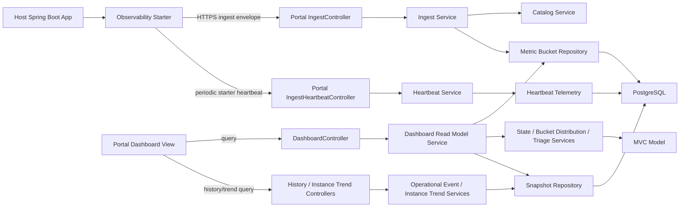

# Architecture - Spring Boot 운영 첫 화면 포털 MVC Version

## 1. 결정 요약

이 프로젝트의 MVC 버전 아키텍처는 **Traditional MVC + Service/Repository Layering** 하나로 고정한다.

기존 제품 약속은 유지한다. 사용자가 starter를 붙이면 30~60초 안에 운영 첫 화면이 보여야 하고, 첫 화면은 `alive / slow / error / where to look first`를 답해야 한다.

이 버전에서는 port/adapter 구조를 만들지 않는다. 구현 경계는 controller, service, repository, model, dto, config로 나누며, 핵심 판단은 service layer가 가진다.

사용자 host app과의 호환성을 위해 starter와 portal의 Java baseline은 **17**로 둔다.

Epic 5/6 dashboard UX 기준은 `project -> application -> dashboard -> instance evidence -> instance snapshot trend -> snapshot/history` 흐름이다. Application Dashboard가 primary first-screen이며 Project Entry와 Application List는 scope 선택/스캔 화면, Instance Detail은 application 판단을 대체하지 않는 evidence drill-down이다.

### 선택한 이유

- 팀이 전통적인 Spring MVC 구현 흐름으로 빠르게 MVP를 만들 수 있다.
- controller-service-repository 구조는 2인 1개월 MVP에서 구현 진입 비용이 낮다.
- 복잡한 의미 판단은 여전히 UI나 DB가 아니라 service layer에 고정한다.
- direct ingest, histogram bucket distribution, starter canonical percentile, freshness/state semantics, triage rule, snapshot read model의 제품 의미를 service/read model 계약에 고정한다.

## 2. 아키텍처 원칙

1. Controller는 HTTP request/response, validation error mapping, status mapping만 맡는다.
2. Service는 use case orchestration과 제품 의미 판단의 단일 원천이다.
3. Service는 빠른 MVC 구현을 위해 필요하면 Spring Data JPA repository와 JPA entity를 직접 사용할 수 있다.
4. Repository는 Spring Data JPA/Jakarta Persistence + Hibernate 기반으로 PostgreSQL 저장/조회와 query 최적화만 맡는다.
5. Model은 프로젝트, 애플리케이션, bucket, state, triage, endpoint priority 같은 제품 언어를 표현한다.
6. DTO는 외부 API shape를 표현하며 controller boundary에서 model/service command로 변환된다.
7. UI는 read model을 표시한다. endpoint ranking, app state, starter connection diagnosis, p95/p99, snapshot/history event를 화면에서 재계산하지 않는다.
8. DB view, trigger, stored procedure는 lifecycle state, insight rule, endpoint priority, p95/p99를 계산하지 않는다.
9. MVP 필수 경로에 pull-based metric collection, scrape configuration, query UI는 포함하지 않는다.
10. 첫 화면 성공 기준을 만족하지 못하면 아키텍처는 실패다.
11. JPA entity는 persistence model이며 controller response DTO, public API surface, service result/external return model로 노출하지 않는다.
12. raw project key 같은 secret은 DB row, migration, log, exception, response body, repository lookup surface에 남기지 않는다.
13. 사용자 account signup과 login은 MVP에서 GitHub OAuth only로 고정한다.
14. API 인증은 cookie 기반 server session이 아니라 `Authorization: Bearer <access_token>` 기준으로 둔다.

## 3. 시스템 경계



### Deployable

MVP runtime deployable은 두 개다.

- `observability-spring-boot-starter`
  - host app 안에서 동작하는 library/starter다.
  - Micrometer metric을 low-cardinality bucket으로 모으고 portal ingest API로 비동기 전송한다.
- `observability-portal`
  - Spring MVC controller, service, repository, persistence, dashboard API를 포함한다.
  - dashboard UI는 MVP에서 별도 backend deployable이 아니라 portal runtime이 제공하는 static view로 둔다.
  - UI는 portal service가 만든 read model만 표시하고 별도 판단 engine을 갖지 않는다.

## 4. Starter Layering

Starter는 host app에 붙는 library라서 전형적인 web controller는 없다. 그래도 MVC 버전에서는 아래의 단순 layered 구조로 둔다.

### Starter Model

- `ApplicationIdentity`
- `InstanceIdentity`
- `NormalizedRoute`
- `MetricBucket`
- `EndpointHistogramBucket`
- `FlushCadence`
- `DropPolicy`

Starter model은 bucket shape와 low-cardinality guard를 표현한다. Spring request 객체나 Micrometer registry 객체를 model에 직접 저장하지 않는다.

### Starter Services

| Service | 책임 |
|---|---|
| `HttpObservationCollectionService` | Spring/Micrometer signal을 low-cardinality observation으로 기록 |
| `MetricBucketRollupService` | 30초 UTC bucket으로 app/endpoint histogram 집계 |
| `IngestEnvelopeBuilderService` | ingest-envelope contract에 맞는 payload 생성 |
| `MetricBucketFlushService` | due bucket을 queue에서 꺼내 portal ingest API 전송 orchestration |
| `StarterHeartbeatService` | project key, portal reachability, metadata shape, starter liveness를 주기적으로 알리는 heartbeat 전송 orchestration |

### Starter Infrastructure

- `spring`
  - auto-configuration
  - Micrometer observation/timer binding
  - HTTP route normalization hook
  - scheduled/background flush trigger
- `client.http`
  - portal ingest HTTP client
- `queue`
  - in-memory bounded queue
- `config`
  - properties binding, default config, bean wiring
  - route attribution allowlist namespace: `observation.route-attribution.allowlist`

### Starter Boundary Rules

- request thread에서는 network call을 하지 않는다.
- request thread는 bounded queue enqueue만 시도한다.
- queue가 가득 차면 configured drop policy를 적용하고 host app business flow를 계속 진행한다.
- flush worker의 HTTP timeout, retry, backoff는 request path와 분리한다.
- MVP에서는 durable outbox를 두지 않는다. 장애 허용 정책은 bounded queue + retry/backoff + drop이다.

## 5. Portal MVC

### Portal Model

- `Project`
- `Application`
- `ApplicationInstance`
- `AcceptedMetricBucket`
- `HistogramSeries`
- `LifecycleState`
- `FreshnessStatus`
- `RuleCandidate`
- `AppTriageSummary`
- `EndpointPriority`
- `DashboardReadModel`

Portal model은 accepted ingest bucket에서 app state, starter canonical percentile 표시, bucket distribution, triage candidate, endpoint priority를 구성하는 데 필요한 제품 언어를 담는다.

### Portal Controllers

| Controller | 책임 |
|---|---|
| `IngestController` | ingest header/body를 DTO로 받고 status code를 mapping |
| `IngestHeartbeatController` | starter heartbeat header/body를 DTO로 받고 status code를 mapping. Metric bucket 수용으로 취급하지 않음 |
| `DashboardController` | dashboard read model query endpoint 제공 |
| `ProjectNavigationController` 후보 | Project Entry와 Application List read-only navigation surface 제공. 상세 판단은 dashboard read model에 위임 |
| `InstanceEvidenceController` 후보 | Instance detail evidence read model 제공. Application state를 재판정하지 않음 |
| `HistoryController` 후보 | operational event history, snapshot detail, instance snapshot trend surface 제공 |
| `AccountAuthController` | GitHub OAuth start/callback, token refresh/logout surface 후보. Provider token/raw payload/secret은 반환하지 않음 |
| `AdminProjectController` | local/internal profile에서 project bootstrap이 필요할 때만 사용 |
| `StaticDashboardController` 또는 static resource config | dashboard static asset 제공 |

Controller는 service를 호출한다. Repository를 직접 호출하지 않는다.

### Portal Services

| Service | 책임 |
|---|---|
| `IngestAcceptanceService` | project key, schema version, idempotency key, bucket boundary, metric taxonomy 검증 후 저장 orchestration |
| `IngestHeartbeatService` | project key와 metadata shape를 검증하고 lightweight heartbeat telemetry를 기록. starter/application process liveness, portal reachability, project key validity, metadata validity의 control-plane source를 만들되 bucket/snapshot/event/metric read-model 계산을 호출하지 않음 |
| `ProjectKeyVerificationService` | raw project key 검증과 project 식별 |
| `AccountAuthService` | GitHub OAuth 성공 결과를 내부 user/account와 연결하고 signup/login 정책을 적용 |
| `ServiceTokenService` | 우리 서비스 access token/refresh token 발급, 검증, rotation/revoke/reuse detection 정책 담당 |
| `ApplicationCatalogService` | project/application/environment/instance 식별과 생성/조회 |
| `HistogramMergeService` | compatibility name. instance bucket을 app/endpoint 기준으로 병합해 bucket distribution display payload를 만들며 p95/p99는 계산하지 않음 |
| `LifecycleStateService` | accepted bucket 기반 metric state(`waiting_first_data`, `unknown`, `idle`, `active`, `stale`, `down`, `degraded`)를 판정하고, heartbeat telemetry가 있으면 starter connection/liveness 축을 별도 diagnosis 입력으로 함께 다룸 |
| `TriageSummaryService` | app-level summary와 rationale 생성 |
| `EndpointPriorityService` | slow/error/comparative evidence 기반 endpoint 목록 생성 |
| `DashboardReadModelService` | UI가 그대로 표시할 read model 반환/생성 |
| `ProjectApplicationNavigationService` 후보 | Project Entry와 Application List의 scope 선택용 read model 생성. 상세 dashboard 판단을 대체하지 않음 |
| `InstanceEvidenceReadModelService` 후보 | Instance Detail의 bounded evidence drill-down read model 생성 |
| `OperationalEventHistoryService` | Epic 5/6 후보. dashboard snapshot/read model 결과를 bounded recent operational event로 요약하되 current state를 재판정하지 않음 |
| `InstanceSnapshotTrendService` 후보 | `dashboard_snapshots.read_model_json`의 bounded instance summary를 특정 instance trend로 projection |
| `RetentionCleanupService` | retention 기준 cleanup orchestration |

### Portal Repositories

| Repository | 책임 |
|---|---|
| `ProjectRepository` | project key 후보 조회, project metadata 저장/조회 |
| `AccountRepository` | 내부 user/account row 저장/조회 |
| `ExternalIdentityRepository` | provider=`github`, provider subject 기반 외부 identity 연결 저장/조회 |
| `RefreshTokenStore` | hashed refresh token 또는 token family metadata 저장소 추상화 |
| `ApplicationRepository` | application/environment row 생성/조회 |
| `ApplicationInstanceRepository` | instance row 생성/조회 및 last seen 갱신 |
| `MetricBucketRepository` | accepted bucket 저장, idempotency 확인, window bucket 조회 |
| `DashboardSnapshotRepository` | dashboard snapshot 저장/조회 |
| `HeartbeatTelemetryRepository` 후보 | starter heartbeat의 `lastHeartbeatAt`, `lastHeartbeatStatus`, failure category 저장/조회. accepted bucket freshness나 metric state 계산에는 사용하지 않고 starter connection surface의 source로만 사용 |

Repository는 state, insight, p95/p99, endpoint priority를 계산하지 않는다. p95/p99는 starter canonical percentile source만 사용하고, histogram bucket은 distribution 표시용으로만 읽는다.

MVP에서는 별도 `OperationalEventRepository`를 만들지 않는다. Operational event history와 instance snapshot trend 후보 service는 `DashboardSnapshotRepository`를 재사용한다.

## 6. 데이터 흐름

### 6.1 Ingest Flow

1. host app request와 runtime signal이 Micrometer로 관측된다.
2. starter spring integration이 observation을 starter service로 전달한다.
3. starter service는 `planning-artifacts/contracts/route-attribution-policy.md`에 따라 route normalization과 low-cardinality guard를 적용한다. `http.route`를 먼저 정규화하고, 그 결과가 `UNKNOWN`이면 low-cardinality `uri`/`path` raw 후보를 query key/value 폐기 후 allowlist exact-one match와 safe prefix collapse에만 사용할 수 있다. normalized route는 policy가 허용한 safe template, safe prefix collapse 결과, allowlist template, `UNKNOWN` 중 하나이며 raw path/query/high-cardinality tag는 ingest envelope와 rollup key에 남지 않는다.
4. starter는 30초 UTC bucket으로 app summary와 endpoint histogram bucket을 만든다.
5. background worker가 ingest envelope를 만들고 HTTPS POST를 수행한다.
6. portal `IngestController`는 payload를 request DTO로 받는다.
7. `IngestAcceptanceService`는 project key, schema version, idempotency key, bucket boundary를 검증한다.
8. repository가 catalog row와 accepted bucket을 저장한다.
9. ingest commit은 dashboard snapshot이나 operational event를 동기 생성하지 않는다.
10. `DashboardReadModelService`는 dashboard query 또는 scheduled snapshot 시 accepted bucket을 metric data source-of-truth로 bucket distribution, metric state, triage, endpoint priority를 구성하고, p95/p99는 starter canonical percentile을 사용한다. Heartbeat telemetry가 있으면 starter connection field를 별도 축으로 추가한다.
11. `DashboardController`는 read model을 UI에 반환한다.

### 6.1.1 Starter Heartbeat Flow

1. starter background scheduler가 configured interval, jitter, backoff에 따라 heartbeat payload를 만든다.
2. heartbeat payload는 project key, schema version, `application/environment/instance` metadata, starter version, sequence, sentAt을 포함한다.
3. portal `IngestHeartbeatController`는 request DTO와 header를 service에 위임한다.
4. `IngestHeartbeatService`는 `ProjectKeyVerificationService`와 ingest metadata validation vocabulary를 재사용해 검증한다.
5. service는 선택적으로 lightweight heartbeat telemetry만 저장한다.
6. heartbeat telemetry는 starter/application process liveness, portal reachability, project key validity, metadata validity의 control-plane source다.
7. heartbeat 성공은 accepted bucket, application/instance catalog row, dashboard snapshot, operational event, p95/p99, rule/metric read-model calculation을 만들지 않는다.
8. heartbeat 미수신은 host application down 판정이 아니며 starter disconnected, telemetry unreachable, unknown 계열의 starter connection 상태로만 표현한다.

### 6.2 Read Flow

1. UI가 Project Entry 또는 Application List read model을 요청해 scope를 고른다.
2. `ProjectNavigationController` 후보 또는 `DashboardController`가 surface별 path variable을 query DTO로 변환한다.
3. Application Dashboard 진입 시 `DashboardReadModelService`는 current 15분 window와 baseline 15분 window 기준 accepted bucket을 읽고, 필요하면 저장된 snapshot 후보를 조회하거나 생성한다.
4. state semantics와 insight rules는 service layer에서 평가된다.
5. Application Dashboard는 반환된 state, metrics, zero-insight reason, recovery guidance, triage cards, endpoint priority, instance summary, snapshot link를 표시한다.
6. Instance Detail은 dashboard read model 또는 instance evidence read model에서 내려온 bounded evidence만 좁혀 보여준다. Application state를 새로 판단하지 않는다.
7. heartbeat telemetry를 표시하더라도 starter connection status와 accepted bucket freshness/application state를 분리한다. 최근 heartbeat와 오래된 accepted bucket 조합은 no recent traffic, waiting for traffic, metric data idle 계열로 표현하고 host application down으로 단정하지 않는다.

### 6.3 Operational Event History Flow 후보

이 flow는 Epic 5/6 착수 전 구현 기준 후보이며 Epic 2/3 구현 범위가 아니다.

1. UI가 bounded recent operational history를 요청한다.
2. `OperationalEventHistoryService` 후보는 `DashboardSnapshotRepository`에서 최근 snapshot을 조회한다.
3. service는 저장된 `state_code`와 `read_model_json`의 state/rule/evidence 결과를 event 후보로 요약한다.
4. service는 current state, p95/p99, insight rule, endpoint priority를 다시 계산하지 않는다.
5. 각 event는 가능한 경우 snapshot/read model detail deep link를 포함한다.
6. UI는 event 목록과 link를 표시할 뿐 운영 판단을 재계산하지 않는다.

### 6.3.1 Instance Snapshot Trend Flow 후보

이 flow는 Instance Detail에서 진입하는 bounded evidence trend다.

1. UI가 특정 `application + instance`의 snapshot trend를 요청한다.
2. `InstanceSnapshotTrendService` 후보는 `DashboardSnapshotRepository`에서 retention 안의 snapshot을 조회한다.
3. service는 `dashboard_snapshots.read_model_json`에 저장된 bounded instance summary에서 해당 instance point만 projection한다.
4. 기본 horizon은 7일, 최대 horizon은 14일 retention 안에서 clamp한다.
5. service는 accepted bucket, heartbeat, resource sample을 live join해 current state나 instance health score를 만들지 않는다.
6. UI는 stored point와 marker overlay를 표시할 뿐 lifecycle state, rule, p95/p99, endpoint priority, operational event를 재계산하지 않는다.

### 6.4 Account Auth Flow

이 flow는 portal 사용자 계정 생성과 login 기준이다. Starter ingest의 `X-OBS-Project-Key` 검증과 섞지 않는다.

1. 사용자가 GitHub OAuth로 signup/login을 시작한다.
2. GitHub OAuth 인증이 성공하면 portal은 provider subject를 검증하고 내부 `user/account` row를 생성하거나 기존 GitHub identity와 연결한다.
3. GitHub OAuth 실패, 취소, 지원하지 않는 provider 요청은 계정을 만들지 않는다.
4. Login은 GitHub OAuth로 연결된 account에만 허용한다.
5. API 호출은 cookie 기반 server session이 아니라 `Authorization: Bearer <access_token>` header를 사용한다.
6. Access Token은 짧은 만료의 stateless JWT로 검증한다.
7. Refresh Token은 Bearer token으로 rotation, 만료, revoke, reuse detection을 적용한다.

GitHub OAuth token과 우리 서비스의 access token/refresh token은 구분한다. MVP에서 GitHub API 호출이 필요 없으면 GitHub OAuth token은 저장하지 않는다. 저장이 필요해지면 암호화, 최소 scope, 만료/회전, 폐기 기준을 먼저 닫는다.

Refresh Token 저장소는 `token store` 추상 기준으로 둔다. 초기 구현 후보는 RDBMS에 hashed refresh token 또는 token family metadata를 저장하는 방식이며, Redis는 고성능 revoke list, distributed token state, reuse detection 최적화가 필요해질 때 후속 선택지로 둔다. `fully stateless refresh token`을 이유로 logout, 강제 만료, 탈취 대응을 약화시키지 않는다.

## 7. 저장소 결정

Portal DB는 PostgreSQL을 기본 선택으로 둔다.

저장 목적은 아래 세 가지다.

- project/application metadata
- bounded accepted bucket data
- derived dashboard snapshot/read model

PostgreSQL을 범용 TSDB처럼 쓰지 않는다. raw unrestricted timeseries query, arbitrary tag search, high-cardinality custom metric 저장은 MVP 범위 밖이다.

### Repository Implementation Standard

observability-portal의 repository 구현 표준은 **Spring Data JPA / Jakarta Persistence + Hibernate**다. Repository는 Flyway migration이 만든 PostgreSQL schema에 mapping하며, schema 생성과 갱신의 source of truth는 Flyway SQL migration이다.

Hibernate DDL auto 생성/갱신은 사용하지 않는다. schema를 변경하지 않는 validation 모드는 Flyway migration과 실제 PostgreSQL schema mismatch를 잡기 위한 보조 검증으로만 허용한다.

Portal은 feature-first package structure를 따른다. JPA entity와 Spring Data repository는 해당 feature package 안의 persistence 책임 위치에 둔다. 빠른 MVC 구현에서는 service가 Spring Data JPA repository와 JPA entity를 직접 사용할 수 있으므로 별도 adapter형 repository 계약을 필수로 만들지 않는다. 다만 JPA entity를 controller response DTO, public API surface, service result/external return model로 반환하지 않는다.

### Repository Boundary

Repository는 다음을 보장한다.

- idempotency key unique constraint
- bucket start/end UTC 저장
- project/application/environment/instance 식별자 정규화
- accepted bucket과 derived snapshot의 transactional consistency

Repository는 다음을 하지 않는다.

- lifecycle state 판단
- insight rule ranking
- endpoint priority 재계산
- UI 문구 생성

## 8. API Boundary

### Account Auth API

- Account signup/login은 GitHub OAuth only다.
- MVP에서는 email/password signup, local account registration, password reset, email verification required for signup, magic link, Google/Kakao/Naver OAuth, anonymous user flow를 열지 않는다.
- API 요청 인증은 `Authorization: Bearer <access_token>` header를 사용한다.
- 일반 resource API response/log/error에는 access token, refresh token, GitHub OAuth token, provider raw payload, secret을 노출하지 않는다.
- OAuth 실패/거부 사유는 provider 내부 정보를 과도하게 노출하지 않는 일반화된 오류로 mapping한다.
- 자세한 기준은 `planning-artifacts/contracts/account-auth-policy.md`를 따른다.

### Ingest API

- `POST /api/ingest/v1/buckets`
- 인증: `X-OBS-Project-Key`
- 멱등성: `Idempotency-Key`
- payload: `ingest-envelope` contract를 따른다.

### Starter Heartbeat API

- `POST /api/ingest/v1/heartbeat`
- 인증: `X-OBS-Project-Key`
- payload: starter version, heartbeat sent time/sequence/interval, `application/environment/instance` metadata 후보
- 의미: metric ingest가 아닌 periodic control-plane/liveness signal. starter/application process liveness, portal reachability, project key validity, metadata validity를 표현
- side effect: accepted bucket, catalog upsert, dashboard snapshot, operational event, p95/p99, rule/metric read-model calculation 없음

### Dashboard API

- `GET /api/projects/{projectId}/applications/{applicationId}/dashboard`
- 반환값은 `read-model-contract` contract를 따른다.
- UI는 이 응답을 source of truth로 사용한다.

### Project/Application Navigation API 후보

- `GET /api/projects`
- `GET /api/projects/{projectId}/applications`
- Project Entry와 Application List를 위한 read-only scope selection surface다.
- Detailed triage, endpoint priority, p95/p99 판단은 Application Dashboard API에서만 제공한다.

### Operational Event History API 후보

- `GET /api/projects/{projectId}/applications/{applicationId}/operational-events`
- `GET /api/projects/{projectId}/applications/{applicationId}/dashboard/snapshots/{snapshotId}`
- `GET /api/projects/{projectId}/applications/{applicationId}/instances/{instanceId}/snapshot-trend`
- Epic 5/6 후보 surface이며 Epic 2/3의 현재 구현 대상이 아니다.
- 반환값은 `operational-event-history` contract와 저장된 dashboard snapshot/read model을 따른다.
- Instance snapshot trend는 stored dashboard snapshot/read model의 bounded instance summary projection이다.
- Alert delivery log API와 섞지 않는다.

## 9. Failure Policy

### Starter Failure

- host app request thread는 portal 응답을 기다리지 않는다.
- bounded queue가 가득 차면 정책에 따라 drop할 수 있다.
- retry/backoff는 background worker 안에서만 수행한다.
- ingest 실패는 host app business flow에 영향을 주지 않는다.
- outbound HTTP timeout은 flush worker 안에서만 적용한다.
- request thread에서 portal 장애를 관측 가능한 latency로 전파하지 않는다.
- heartbeat 실패도 fail-open이며 host startup/request path를 막지 않는다.

### Portal Failure

- ingest payload 검증 실패는 4xx로 반환한다.
- 중복 payload는 idempotent success로 처리한다.
- persistence 장애는 5xx로 반환하되 starter가 비동기로 재시도하거나 drop한다.
- portal 장애는 host app request path를 막지 않는다.

## 10. Package Map

### Starter

```text
com.observation.starter
  model
    identity
    metric
    route
    time
  service
  spring
    observation
    autoconfigure
    schedule
  client.http
  queue
  config
```

### Portal

```text
com.observation.portal
  domain
    ingest
      controller
      dto
      service
    catalog
      controller
      dto
      entity
      model
      repository
      service
    account
      controller
      dto
      entity
      model
      repository
      service
    bucket
      entity
      repository
      service
    dashboard
      controller
      dto
      model
      service
    metric
      model
      repository
      service
    state
      model
      service
    triage
      model
      service
    cleanup
      service
    snapshot
      entity
      repository
    history
      controller
      dto
      service
    instance
      controller
      dto
      service
  security
  scheduler
  config
```

## 11. 테스트 전략

- Model/service test: state semantics, histogram merge, rule ranking, endpoint priority.
- Controller slice test: REST contract, HTTP status mapping, DTO validation.
- Repository test: PostgreSQL Testcontainers에서 Flyway migration, Spring Data JPA mapping, idempotency constraint, catalog schema, project key lookup을 검증한다.
- Starter test: route normalization, bucket rollup, queue overflow, HTTP client failure.
- MVC layer guard test: controller가 repository를 직접 참조하지 않고, repository가 controller/dto를 참조하지 않는지 검사.
- Negative MVP path test: scrape config, pull metric query, arbitrary query UI, high-cardinality tag path가 없음을 검사.
- Read model snapshot test: `triageCards=[]`일 때 zero-insight reason과 recommended action이 항상 내려오는지 검사.
- Dashboard navigation read model test: Project Entry와 Application List가 scope 선택과 light summary만 제공하고 dashboard 판단을 대체하지 않는지 검사.
- Instance evidence read model test: Instance Detail이 application state를 재판정하지 않고 accepted bucket axis와 starter heartbeat axis를 분리하는지 검사.
- Instance snapshot trend projection test: stored dashboard snapshot/read model에서 bounded instance summary만 projection하고 raw bucket/endpoint timeseries를 제공하지 않는지 검사.
- Histogram bucket distribution fixture test: 동일 bucket set에서 app/endpoint bucket distribution merge가 fixture 기대값과 일치하고 p95/p99 scalar를 만들지 않는지 검사.
- Non-blocking ingest test: portal timeout/down 상황에서도 host request latency가 network timeout을 기다리지 않는지 검사.
- End-to-end slice: starter emits first bucket -> portal accepts -> dashboard shows app alive.
- Heartbeat contract test: valid heartbeat returns received status without bucket/snapshot/event/read-model side effects, and two-axis state tests keep recent heartbeat plus old/missing bucket in no-recent-traffic/waiting-for-traffic semantics.

## 12. 명시적으로 계승하지 않는 결정

- pull-based metric backend를 MVP source of truth로 두는 결정
- scrape target, selector bootstrap, query profile 중심 구조
- port/adapter 중심 package 구조
- UI에서 endpoint ranking 또는 state semantics를 재계산하는 결정
- 범용 metric platform이나 arbitrary query UI로 확장하는 결정

이번 MVC 버전의 단일 선택은 **Traditional MVC + Service/Repository Layering**이다.
