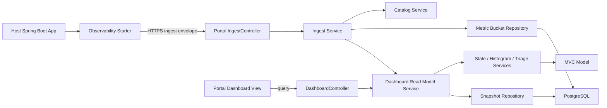

# Architecture - Spring Boot 운영 첫 화면 포털 MVC Version

## 1. 결정 요약

이 프로젝트의 MVC 버전 아키텍처는 **Traditional MVC + Service/Repository Layering** 하나로 고정한다.

기존 제품 약속은 유지한다. 사용자가 starter를 붙이면 30~60초 안에 운영 첫 화면이 보여야 하고, 첫 화면은 `alive / slow / error / where to look first`를 답해야 한다.

이 버전에서는 port/adapter 구조를 만들지 않는다. 구현 경계는 controller, service, repository, model, dto, config로 나누며, 핵심 판단은 service layer가 가진다.

사용자 host app과의 호환성을 위해 starter와 portal의 Java baseline은 **17**로 둔다.

### 선택한 이유

- 팀이 전통적인 Spring MVC 구현 흐름으로 빠르게 MVP를 만들 수 있다.
- controller-service-repository 구조는 2인 1개월 MVP에서 구현 진입 비용이 낮다.
- 복잡한 의미 판단은 여전히 UI나 DB가 아니라 service layer에 고정한다.
- direct ingest, histogram merge, freshness/state semantics, triage rule, snapshot read model의 제품 의미는 기존과 동일하게 유지한다.

## 2. 아키텍처 원칙

1. Controller는 HTTP request/response, validation error mapping, status mapping만 맡는다.
2. Service는 use case orchestration과 제품 의미 판단의 단일 원천이다.
3. Repository는 PostgreSQL 저장/조회와 query 최적화만 맡는다.
4. Model은 프로젝트, 애플리케이션, bucket, state, triage, endpoint priority 같은 제품 언어를 표현한다.
5. DTO는 외부 API shape를 표현하며 controller boundary에서 model/service command로 변환된다.
6. UI는 read model을 표시한다. endpoint ranking, app state, p95를 화면에서 재계산하지 않는다.
7. DB view, trigger, stored procedure는 lifecycle state, insight rule, endpoint priority, p95를 계산하지 않는다.
8. MVP 필수 경로에 pull-based metric collection, scrape configuration, query UI는 포함하지 않는다.
9. 첫 화면 성공 기준을 만족하지 못하면 아키텍처는 실패다.

## 3. 시스템 경계



### Deployable

MVP runtime deployable은 두 개다.

- `observability-spring-boot-starter`
  - host app 안에서 동작하는 library/starter다.
  - Micrometer metric을 low-cardinality bucket으로 모으고 portal ingest API로 비동기 전송한다.
- `observability-portal`
  - Spring MVC controller, service, repository, persistence, dashboard API를 포함한다.
  - dashboard UI는 MVP에서 별도 backend deployable이 아니라 portal runtime이 제공하는 static view로 둔다.
  - UI는 portal service가 만든 read model만 표시하고 별도 판단 engine을 갖지 않는다.

## 4. Starter Layering

Starter는 host app에 붙는 library라서 전형적인 web controller는 없다. 그래도 MVC 버전에서는 아래의 단순 layered 구조로 둔다.

### Starter Model

- `ApplicationIdentity`
- `InstanceIdentity`
- `NormalizedRoute`
- `MetricBucket`
- `EndpointHistogramBucket`
- `FlushCadence`
- `DropPolicy`

Starter model은 bucket shape와 low-cardinality guard를 표현한다. Spring request 객체나 Micrometer registry 객체를 model에 직접 저장하지 않는다.

### Starter Services

| Service | 책임 |
|---|---|
| `HttpObservationCollectionService` | Spring/Micrometer signal을 low-cardinality observation으로 기록 |
| `MetricBucketRollupService` | 30초 UTC bucket으로 app/endpoint histogram 집계 |
| `IngestEnvelopeBuilderService` | ingest-envelope contract에 맞는 payload 생성 |
| `MetricBucketFlushService` | due bucket을 queue에서 꺼내 portal ingest API 전송 orchestration |

### Starter Infrastructure

- `spring`
  - auto-configuration
  - Micrometer observation/timer binding
  - HTTP route normalization hook
  - scheduled/background flush trigger
- `client.http`
  - portal ingest HTTP client
- `queue`
  - in-memory bounded queue
- `config`
  - properties binding, default config, bean wiring

### Starter Boundary Rules

- request thread에서는 network call을 하지 않는다.
- request thread는 bounded queue enqueue만 시도한다.
- queue가 가득 차면 configured drop policy를 적용하고 host app business flow를 계속 진행한다.
- flush worker의 HTTP timeout, retry, backoff는 request path와 분리한다.
- MVP에서는 durable outbox를 두지 않는다. 장애 허용 정책은 bounded queue + retry/backoff + drop이다.

## 5. Portal MVC

### Portal Model

- `Project`
- `Application`
- `ApplicationInstance`
- `AcceptedMetricBucket`
- `HistogramSeries`
- `LifecycleState`
- `FreshnessStatus`
- `RuleCandidate`
- `AppTriageSummary`
- `EndpointPriority`
- `DashboardReadModel`

Portal model은 accepted ingest bucket에서 app state, p95, triage candidate, endpoint priority를 계산하는 데 필요한 제품 언어를 담는다.

### Portal Controllers

| Controller | 책임 |
|---|---|
| `IngestController` | ingest header/body를 DTO로 받고 status code를 mapping |
| `DashboardController` | dashboard read model query endpoint 제공 |
| `AdminProjectController` | local/internal profile에서 project bootstrap이 필요할 때만 사용 |
| `StaticDashboardController` 또는 static resource config | dashboard static asset 제공 |

Controller는 service를 호출한다. Repository를 직접 호출하지 않는다.

### Portal Services

| Service | 책임 |
|---|---|
| `IngestAcceptanceService` | project key, schema version, idempotency key, bucket boundary, metric taxonomy 검증 후 저장 orchestration |
| `ProjectKeyVerificationService` | raw project key 검증과 project 식별 |
| `ApplicationCatalogService` | project/application/environment/instance 식별과 생성/조회 |
| `HistogramMergeService` | instance bucket을 app/endpoint 기준으로 병합하고 p95 계산 |
| `LifecycleStateService` | waiting first data, unknown, idle, stale, down 판정 |
| `TriageSummaryService` | app-level summary와 rationale 생성 |
| `EndpointPriorityService` | slow/error/comparative evidence 기반 endpoint 목록 생성 |
| `DashboardReadModelService` | UI가 그대로 표시할 read model 반환/생성 |
| `RetentionCleanupService` | retention 기준 cleanup orchestration |

### Portal Repositories

| Repository | 책임 |
|---|---|
| `ProjectRepository` | project key 후보 조회, project metadata 저장/조회 |
| `ApplicationRepository` | application/environment row 생성/조회 |
| `ApplicationInstanceRepository` | instance row 생성/조회 및 last seen 갱신 |
| `MetricBucketRepository` | accepted bucket 저장, idempotency 확인, window bucket 조회 |
| `DashboardSnapshotRepository` | dashboard snapshot 저장/조회 |

Repository는 state, insight, p95, endpoint priority를 계산하지 않는다.

## 6. 데이터 흐름

### 6.1 Ingest Flow

1. host app request와 runtime signal이 Micrometer로 관측된다.
2. starter spring integration이 observation을 starter service로 전달한다.
3. starter service는 route normalization과 low-cardinality guard를 적용한다.
4. starter는 30초 UTC bucket으로 app summary와 endpoint histogram bucket을 만든다.
5. background worker가 ingest envelope를 만들고 HTTPS POST를 수행한다.
6. portal `IngestController`는 payload를 request DTO로 받는다.
7. `IngestAcceptanceService`는 project key, schema version, idempotency key, bucket boundary를 검증한다.
8. repository가 catalog row와 accepted bucket을 저장한다.
9. service는 histogram merge와 read model refresh를 수행한다.
10. `DashboardController`는 snapshot read model을 UI에 반환한다.

### 6.2 Read Flow

1. UI가 dashboard snapshot을 요청한다.
2. `DashboardController`는 path variable을 query DTO로 변환한다.
3. `DashboardReadModelService`는 current 15분 window와 baseline 15분 window 기준 snapshot을 조회하거나 생성한다.
4. state semantics와 insight rules는 service layer에서 평가된다.
5. UI는 반환된 state, metrics, zero-insight reason, recovery guidance, triage cards, endpoint priority를 표시한다.

## 7. 저장소 결정

Portal DB는 PostgreSQL을 기본 선택으로 둔다.

저장 목적은 아래 세 가지다.

- project/application metadata
- bounded accepted bucket data
- derived dashboard snapshot/read model

PostgreSQL을 범용 TSDB처럼 쓰지 않는다. raw unrestricted timeseries query, arbitrary tag search, high-cardinality custom metric 저장은 MVP 범위 밖이다.

### Repository Boundary

Repository는 다음을 보장한다.

- idempotency key unique constraint
- bucket start/end UTC 저장
- project/application/environment/instance 식별자 정규화
- accepted bucket과 derived snapshot의 transactional consistency

Repository는 다음을 하지 않는다.

- lifecycle state 판단
- insight rule ranking
- endpoint priority 재계산
- UI 문구 생성

## 8. API Boundary

### Ingest API

- `POST /api/ingest/v1/buckets`
- 인증: `X-OBS-Project-Key`
- 멱등성: `Idempotency-Key`
- payload: `ingest-envelope` contract를 따른다.

### Dashboard API

- `GET /api/projects/{projectId}/applications/{applicationId}/dashboard`
- 반환값은 `read-model-contract` contract를 따른다.
- UI는 이 응답을 source of truth로 사용한다.

## 9. Failure Policy

### Starter Failure

- host app request thread는 portal 응답을 기다리지 않는다.
- bounded queue가 가득 차면 정책에 따라 drop할 수 있다.
- retry/backoff는 background worker 안에서만 수행한다.
- ingest 실패는 host app business flow에 영향을 주지 않는다.
- outbound HTTP timeout은 flush worker 안에서만 적용한다.
- request thread에서 portal 장애를 관측 가능한 latency로 전파하지 않는다.

### Portal Failure

- ingest payload 검증 실패는 4xx로 반환한다.
- 중복 payload는 idempotent success로 처리한다.
- persistence 장애는 5xx로 반환하되 starter가 비동기로 재시도하거나 drop한다.
- portal 장애는 host app request path를 막지 않는다.

## 10. Package Map

### Starter

```text
com.observation.starter
  model
    identity
    metric
    route
    time
  service
  spring
    observation
    autoconfigure
    schedule
  client.http
  queue
  config
```

### Portal

```text
com.observation.portal
  controller
    ingest
    dashboard
    admin
  service
    ingest
    catalog
    metric
    state
    triage
    dashboard
    cleanup
  repository
    catalog
    bucket
    snapshot
  model
    catalog
    metric
    state
    triage
    time
  dto
    ingest
    dashboard
    admin
  security
  scheduler
  config
```

## 11. 테스트 전략

- Model/service test: state semantics, histogram merge, rule ranking, endpoint priority.
- Controller slice test: REST contract, HTTP status mapping, DTO validation.
- Repository test: PostgreSQL repository, idempotency constraint, catalog schema, project key lookup.
- Starter test: route normalization, bucket rollup, queue overflow, HTTP client failure.
- MVC layer guard test: controller가 repository를 직접 참조하지 않고, repository가 controller/dto를 참조하지 않는지 검사.
- Negative MVP path test: scrape config, pull metric query, arbitrary query UI, high-cardinality tag path가 없음을 검사.
- Read model snapshot test: `triageCards=[]`일 때 zero-insight reason과 recommended action이 항상 내려오는지 검사.
- Histogram golden fixture test: 동일 bucket set에서 server-side merge p95가 fixture 기대값과 일치하는지 검사.
- Non-blocking ingest test: portal timeout/down 상황에서도 host request latency가 network timeout을 기다리지 않는지 검사.
- End-to-end slice: starter emits first bucket -> portal accepts -> dashboard shows app alive.

## 12. 명시적으로 계승하지 않는 결정

- pull-based metric backend를 MVP source of truth로 두는 결정
- scrape target, selector bootstrap, query profile 중심 구조
- port/adapter 중심 package 구조
- UI에서 endpoint ranking 또는 state semantics를 재계산하는 결정
- 범용 metric platform이나 arbitrary query UI로 확장하는 결정

이번 MVC 버전의 단일 선택은 **Traditional MVC + Service/Repository Layering**이다.
