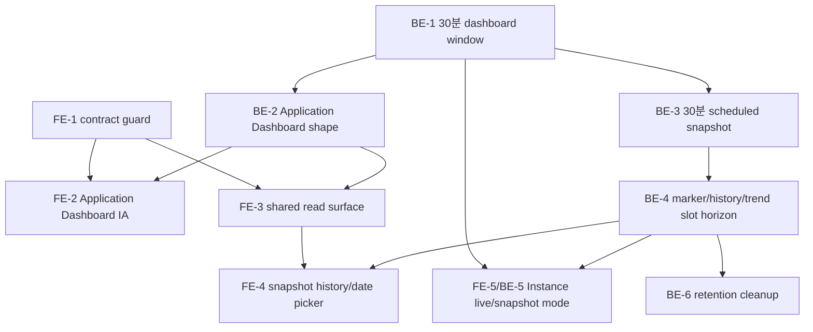

# Dashboard Source of Truth Realignment Roadmap

## 1. 목적

이 문서는 확정된 Source of Truth를 현재 Observation Portal UI/API/read model 구현 흐름에 어떤 순서로 적용할지 정리한다.

이 문서에서는 Source of Truth 자체를 다시 토론하거나 재정의하지 않는다. 논의 대상은 "무엇이 맞는 계약인가?"가 아니라 "이미 정해진 계약을 현재 화면과 코드에 어떤 순서로 안전하게 적용할 것인가?"다.

## 2. Story 운영 결정

완료된 Epic 5/6 story를 하나씩 다시 열어 수정하기보다, 별도의 alignment epic 또는 sprint change 묶음으로 새 후속 story를 만드는 것이 맞다.

이유는 아래와 같다.

- 완료 story를 직접 고치면 당시 acceptance, baseline commit, retro, sprint status의 추적성이 흐려진다.
- 이번 작업은 개별 버그 수정이 아니라 Application Dashboard, Snapshot, Instance Dashboard, retention UX의 Source of Truth 적용 순서를 다시 맞추는 cross-cutting 재정렬이다.
- 이미 완료된 story 산출물은 "당시 구현 이력"으로 보존하고, 새 story가 어떤 완료 story를 supersede, align, harden하는지 명시하는 편이 안전하다.
- 아직 `todo` 또는 구현 전 story가 있다면 해당 story는 직접 갱신할 수 있다. 그러나 `status: done` story는 본문을 덮어쓰기보다 새 alignment story에서 참조한다.

권장 방식:

1. `Dashboard Source of Truth Realignment`를 새 alignment epic으로 둔다.
2. 완료된 story는 수정하지 않고 새 story의 `Background / Supersedes / Aligns` 섹션에서 참조한다.
3. 꼭 필요한 경우 완료 story 상단에 짧은 compatibility note만 별도 story로 추가한다.
4. `implementation-artifacts/sprint-status.yaml` 또는 후속 sprint plan에는 새 alignment story를 추가해 현재 작업 상태를 추적한다.

## 3. 현재 Gap Map

| 영역 | 현재 상태 | Source of Truth 적용 gap | 적용 순서 |
|---|---|---|---|
| Application Dashboard UI | `DashboardMain`의 current 탭이 상태, starter, metric visualization, triage 순으로 렌더링된다. | 운영자 질문 순서인 판단 가능성, application state, direct evidence, attention evidence, metric detail이 명확히 분리되지 않는다. | Frontend IA 재정렬을 먼저 수행한다. |
| Frontend adapter/type | `ApplicationDashboardReadModel` 타입이 기존 `sourceWindow.current/baseline`, `triageCards`, `endpointPriority` 중심이다. | `mode`, `window`, `thresholds`, `operatorSummary`, `signals`, `attentionEvidence`, `firstLookCandidates`, `readSemantics` shape 흡수가 부족하다. | adapter/type guard를 먼저 만들고 UI migration을 진행한다. |
| Snapshot history UI | marker와 operational event를 같은 history surface에 놓고 client에서 재정렬한다. | MVP history의 1차 역할은 event/incident가 아니라 14일 retention 안의 30분 dashboard point 탐색이다. | marker-first history로 재정렬하고 server order를 보존한다. |
| Snapshot detail UI | stored snapshot detail guard는 있지만 live dashboard surface와 별도 compact projection이다. | Snapshot detail은 저장된 dashboard read model을 dashboard처럼 복원해야 한다. | live/snapshot 공용 dashboard read surface를 만든 뒤 snapshot mode를 분기한다. |
| Time window backend | `TimeBucketWindowCalculator`가 15분 current와 15분 baseline을 계산한다. | Dashboard 판단 window는 최근 30분이고 baseline 비교는 MVP 판단 기준이 아니다. | backend 공통 window를 30분으로 맞춘다. |
| Snapshot scheduler | scheduler는 hourly target span과 `hourly_scheduled` 중심으로 동작한다. | 사용자-facing scheduled snapshot UX는 30분 slot이다. `hourly_scheduled`는 legacy persistence/API token으로만 유지한다. | scheduler slot을 30분으로 바꾸되 token rename은 하지 않는다. |
| Marker/trend horizon | marker/trend query가 `generatedAt` horizon을 사용한다. | retention/read horizon은 snapshot slot 의미에 맞춰 `current_window_end_utc` 기준이어야 한다. | repository query를 slot 기준으로 정렬한다. |
| Instance Evidence | live evidence에 `current_15m` naming과 15분 shape가 남아 있다. | Instance Dashboard는 Application Dashboard와 같은 30분 window의 selected instance evidence detail이다. | live instance evidence를 30분으로 정렬한 뒤 snapshot mode를 추가한다. |
| Instance Snapshot Trend | stored `instanceSummary.items[]` projection 경계는 대체로 맞다. | trend UI가 독립 instance health timeline처럼 보이면 안 된다. | source/copy/order guard를 보강한다. |
| Retention cleanup | production cleanup job은 후속 구현 대상이다. | cleanup 기준은 snapshot `current_window_end_utc`, metric `bucket_end_utc` + 30분 evidence grace다. | read horizon 정렬 후 마지막에 넣는다. |

## 4. 목표 UI 정보 구조

전체 진입 흐름은 아래로 고정한다.

```text
project -> application -> dashboard -> snapshot / instance
```

Application Dashboard는 운영 첫 화면이다. Project와 Application rail은 scope 선택과 탐색을 돕지만 application 판단을 대체하지 않는다. Snapshot과 Instance는 모두 Application Dashboard를 복원하거나 설명하는 하위 surface다.

권장 화면 구조:

1. Project rail
2. Application rail
3. Application Dashboard live surface
4. Snapshot history/date map/picker
5. Application Snapshot Detail
6. Instance Evidence Detail
7. Instance Dashboard snapshot mode
8. Instance Snapshot Trend

Application Dashboard live surface 섹션 순서:

1. Context/read semantics bar
   - project, application, environment
   - mode `live`
   - source `accepted_metric_buckets`
   - window `recent_30_minutes`
2. Data quality/freshness strip
   - 판단 가능 여부, sample readiness, last observed, limitations
3. Application lifecycle state hero
   - state label, rationale, recommended action
4. Direct state reasons
   - state를 만든 직접 근거
5. Attention evidence / first look candidates
   - state를 바꾸지 않지만 먼저 볼 endpoint/resource/data-quality evidence
6. Endpoint/resource evidence
   - bounded evidence 목록
7. Metric detail
   - request/error scalar, histogram distribution, source-scoped percentile point
8. Starter connection
   - metric state와 분리된 control-plane surface
9. Instance evidence entry
   - Application 판단을 대체하지 않는 selected instance drill-down

## 5. Frontend 재정렬 Milestones

### FE-1. Read Model Contract Guard

목표:

- UI가 lifecycle state, endpoint priority, marker bucket, instance health, resource pattern을 재계산하지 않게 adapter/type/test 경계를 먼저 만든다.

완료 조건:

- adapter는 server-computed order와 value를 보존한다.
- 표시용 변환은 날짜, badge class, humanized copy, histogram cumulative-to-display bucket 변환으로 제한한다.
- snapshot marker/trend point를 client에서 임의 재정렬하지 않는다.

구현 handoff 기록:

- 2026-06-10: Story `13-2-frontend-read-model-contract-guard`에서 frontend P1 guard를 구현하고 BMAD review 보강 후 done 상태로 넘겼다.
- 추가된 guard는 Application Dashboard, snapshot history/detail, instance evidence, instance trend가 server-computed state/order/source semantics를 재계산하지 않는지 fixture로 검증한다.
- BMAD review 보강으로 dashboard percentile/histogram policy drift, marker-as-state history semantics, nested instance decision field, 30분 trend limit/maxLimit 회귀를 fail-closed로 막는다.
- snapshot detail은 `readSemantics.markerIsStateSource=false`, `currentStateRecalculated=false`, `liveSourcesJoined=[]`, `rawReadModelJsonExposed=false`가 깨지면 fail-closed한다.
- dashboard snapshot history와 instance trend UI의 client-side reorder 후보를 제거해 event/marker/trend point를 server response array order 그대로 렌더링한다.
- 후속 P2/P3 backend shape가 `markerIsStateSource`를 아직 제공하지 않으면 snapshot detail은 의도적으로 safe error로 수렴할 수 있다. 이 경우 guard 완화보다 backend/read model contract 정렬을 우선한다.
- code review는 Story 13.2 acceptance와 `npm run guard:read-model-contract`, `typecheck`, `build`, static grep 결과를 기준으로 수행한다.

### FE-2. Application Dashboard Live IA

목표:

- 현재 `DashboardMain`의 current surface를 Source of Truth 독서 순서로 재배치한다.

완료 조건:

- 첫 화면 상단에서 live mode, recent 30 minutes, accepted metric bucket source가 드러난다.
- starter connection과 credential lifecycle은 application metric state와 섞이지 않는 보조 surface로 내려간다.
- triage/state reason과 attention evidence가 metric visualization보다 먼저 읽힌다.

### FE-3. Shared Dashboard Read Surface

목표:

- live dashboard와 snapshot detail이 같은 시각 골격을 공유하고 data loader/source/copy만 분기한다.

완료 조건:

- `mode=live`는 `accepted_metric_buckets` source를 표시한다.
- `mode=snapshot`은 `dashboard_snapshots.read_model_json` source와 "현재 상태 재계산 아님" guard를 상단에 고정한다.
- expired/404 snapshot은 live dashboard fallback처럼 보이지 않는다.

### FE-4. Snapshot History, Date Map, Picker

목표:

- snapshot history를 marker-first 30분 slot 탐색 UI로 정리한다.

완료 조건:

- 24h/7d/14d 또는 date map/picker는 모두 14일 retention 안에서만 동작한다.
- marker bucket은 state가 아니라 timeline 탐색 색인으로 표현된다.
- `hourly_scheduled` token은 사용자-facing copy에서 "30분 정기 저장" 의미로 표현된다.

### FE-5. Instance Surface Split

목표:

- Instance detail, Instance Dashboard snapshot mode, Instance Snapshot Trend를 서로 다른 surface 책임으로 분리한다.

완료 조건:

- live instance detail은 selected instance evidence detail로만 보인다.
- snapshot mode는 selected Application Snapshot row window 기준임을 드러낸다.
- trend는 stored `instanceSummary.items[]` projection이며 독립 instance health timeline처럼 보이지 않는다.

## 6. Backend / Read Model 재정렬 Milestones

### BE-1. 30분 Dashboard Window

목표:

- Application Dashboard live와 Instance Dashboard live가 같은 recent 30 minutes window를 사용한다.

완료 조건:

- 공통 window calculator가 30분 current window를 반환한다.
- baseline 비교는 MVP 판단 path에서 제거되거나 non-primary diagnostic으로 격리된다.
- 기존 15분 naming은 public response에서 사라진다.

### BE-2. Application Dashboard Shape Alignment

목표:

- Application Dashboard API가 Source of Truth shape를 안정적으로 제공한다.

완료 조건:

- `mode`, `window`, `thresholds`, `operatorSummary`, `dataQuality`, `signals`, `stateReasons`, `attentionEvidence`, `firstLookCandidates`, `readSemantics`가 contract shape에 맞는다.
- live source는 `accepted_metric_buckets`다.
- UI가 재계산해야만 이해되는 field가 남지 않는다.

### BE-3. 30분 Scheduled Snapshot Capture

목표:

- scheduled snapshot UX를 30분 slot에 맞춘다.

완료 조건:

- scheduler가 30분 slot을 dispatch한다.
- writer identity는 `application_id + current_window_end_utc`를 유지한다.
- persisted reason token `hourly_scheduled` rename은 하지 않는다.

### BE-4. Snapshot Detail / Marker / Trend Horizon

목표:

- snapshot read surface를 slot 기준 retention/read horizon과 맞춘다.

완료 조건:

- detail은 `dashboard_snapshots.read_model_json`만 source로 사용한다.
- marker/history/trend 조회 horizon은 `current_window_end_utc` 기준이다.
- marker bucket은 lifecycle state source가 아니라 timeline index다.
- instance trend는 stored `instanceSummary.items[]` projection으로 제한된다.

### BE-5. Instance Dashboard Snapshot Mode

목표:

- selected Application Snapshot row의 window 기준으로 selected instance evidence를 재구성한다.

완료 조건:

- snapshot mode는 `dashboard_snapshots` row metadata에서 window를 얻는다.
- selected instance metric evidence는 현재 저장소에 남은 `accepted_metric_buckets`에서 재구성한다.
- accepted-at cutoff를 적용하지 않으며 late metric 포함 가능성을 read semantics에 드러낸다.
- Application Snapshot state/evidence를 검증하거나 대체하지 않는다.

### BE-6. Retention Cleanup

목표:

- 14일 retention UX와 physical cleanup을 맞춘다.

완료 조건:

- snapshot cleanup 기준은 `dashboard_snapshots.current_window_end_utc`다.
- metric cleanup 기준은 `accepted_metric_buckets.bucket_end_utc`다.
- metric cleanup에는 가장 오래된 retained snapshot의 30분 window를 보존하는 evidence grace가 있다.
- cleanup으로 사라진 snapshot은 live dashboard나 current accepted bucket으로 복원하지 않는다.

## 7. Dependency Graph



## 8. Risk and Rollback

가장 큰 리스크:

1. 15분 window에서 30분 window로 바꾸는 공통 backend 변경
2. frontend가 server-computed priority/order/state를 표시 편의로 다시 정렬하는 것
3. snapshot detail과 live dashboard를 재사용하면서 snapshot mode가 current metric fallback처럼 보이는 것
4. marker bucket이 lifecycle state처럼 읽히는 것
5. cleanup을 read horizon 정렬 전에 넣어 14일 UX와 실제 조회 결과가 어긋나는 것

Rollback 가능한 단위:

- FE-1/FE-2는 UI surface 단위 rollback이 가능하다.
- BE-1은 공통 window라 가장 위험하다. property 또는 compatibility branch로 15분/30분 전환 지점을 명확히 둔다.
- BE-3은 scheduler cadence만 rollback할 수 있게 token rename과 writer identity 변경을 피한다.
- BE-4는 repository query를 generatedAt/currentWindowEndUtc path로 일시 병존시킬 수 있다.
- BE-6 cleanup은 dry-run/count-first, disabled-by-default로 시작한다.

## 9. 검증 전략

Frontend:

- adapter fixture test로 state, endpointPriority, instance list, marker/trend point order가 보존되는지 검증한다.
- snapshot detail은 `currentStateRecalculated=false`, `liveSourcesJoined=[]`, `rawReadModelJsonExposed=false`가 깨지면 fail-closed한다.
- UI copy가 live, stored snapshot, selected instance evidence를 혼동시키지 않는지 수동 확인한다.

Backend:

- 30분 window boundary test를 추가한다.
- Application Dashboard live source가 `accepted_metric_buckets`임을 검증한다.
- Snapshot detail service가 current dashboard, metric bucket, heartbeat를 조인하지 않는 regression guard를 둔다.
- Marker/history/trend query가 `current_window_end_utc` horizon을 쓰는지 검증한다.
- Cleanup은 cutoff 계산, idempotency, 30분 evidence grace를 테스트한다.

## 10. 바로 넘길 Story 후보

### Story A. Frontend Read Model Contract Guard

Frontend adapter와 UI fixture test를 추가해 server-computed lifecycle state, endpointPriority, instance list, marker/trend order를 재계산하거나 재정렬하지 않도록 고정한다.

### Story B. Application Dashboard Live IA Realignment

현재 Application Dashboard current surface를 Source of Truth 독서 순서로 재배치한다. Context/read semantics, data quality, state, direct evidence, attention evidence, metric detail, starter connection, instance entry 순서로 정리한다.

### Story C. Backend Recent 30 Minutes Window Alignment

공통 dashboard window를 recent 30 minutes로 전환하고 Application Dashboard와 Instance live evidence가 같은 window를 쓰도록 service/test를 정렬한다.

### Story D. Snapshot History and Detail Realignment

Snapshot history를 marker-first 30분 dashboard point 탐색 UI로 바꾸고, Snapshot detail을 stored dashboard read model 복원 surface로 격상한다. Marker bucket은 state가 아니라 timeline index로 표시한다.

### Story E. Instance Dashboard Mode Split

Instance live detail, selected Application Snapshot window 기반 snapshot mode, stored `instanceSummary.items[]` trend를 별도 surface/API 책임으로 분리한다.

### Story F. Retention Cleanup Alignment

Read horizon 정렬 후 snapshot과 accepted metric bucket cleanup을 14일 retention, `current_window_end_utc`, `bucket_end_utc`, 30분 evidence grace 기준으로 구현한다.
